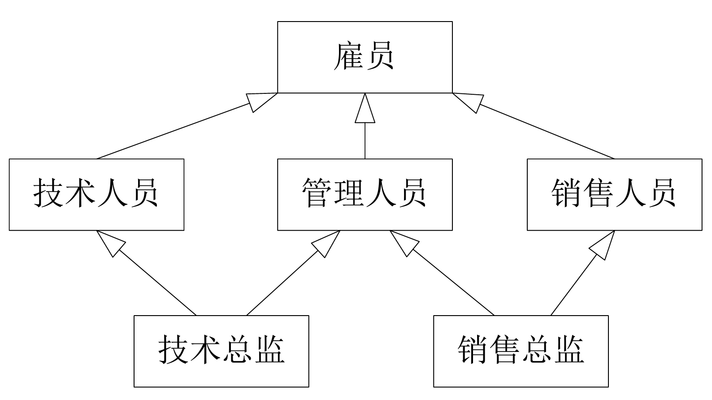

# 上机作业代码备份

本文档为大连理工大学软件工程学院（软件工程系）2023 级的 “程序设计基础”“数据结构与算法” 等课程中的 C/C++ 的相关上机代码备份。
当前页面仅记录这些作业的内容（可能包含输入及输出样例）。

由于 Pangu 插件的抽风，文中所附代码的格式可能有些错乱。

## 大一秋季学期（C 语言）

### 第一次上机

写一个 "Hello World" 程序。

### 第二次上机

=== "1. 大小写转化"

    从键盘输入一个字符，如果是大写英文字母，则输出其小写形式；如果是小写英文字母，输出其大写形式；否则输出 `输入错误`。注意输出必要的提示信息，另外尝试做输入有效性验证，比如输入错误时可以允许继续输入。输入有效性验证涉及到循环，不做硬性要求。

=== "2. 单位数转化"

    在美国体积测量系统中，1`pint` 是 2`cups`，1`cup` 是 8`ounces`，1`ounce` 是 2`tablespoons`，1`tablespoon` 是 3`teaspoons`。编写一个程序，输入 `cup` 数，求出对应的 `pint`、`ounce`、`tablespoon` 和 `teaspoon` 数。

=== "3. 字符串加密"

    设计一个简单的字符串加密算法，不限于如下两种算法：将字符串译成密码，密码规律是用原来的字母后面的第四个字母代替原来的字符，例如，字母 `A` 后面 4 个字母是 `E`，用 `E` 代替 `A`；字母 `x` 经转换后变为 `b`，因此 `China` 应译为 `Glmre`，编写一个程序，输入一个长度不超过 10 个字符串，输出经过加密运算后的密码。

=== "4. 字符串加密"

    间谍机器人能够进行加密解密工作，目前采用的加密技术是将 a-z 个字母中的前 10 个字母 a-j 用 0-9 这十个数替换，后面的 16 个字母 k,l,…y,z 分别用 l,m,…z,k 替换，请输入一个字符，输出加密后应该是哪个字符。

### 第三次上机

=== "1. 判断三角"
    输入三角形的三个边长，计算最大角的正弦值及三角形面积和三角形种类（直角、钝角、锐角）。注意对三角形边长合理性的判断。

=== "2. 冰箱温度"

    编写程序预测断电后冰箱的温度。断电后经过一段时间，温度保持情况由如下公式决定：
    
    $$T=\frac {4t^{2}}{t+2}-20$$

    其中，t 为断电后经过的时间（小时），T 为温度（℃）。经过若干小时候冰箱温度接近室温并保持不变。假设室温为 18℃. 程序提示用户输入时间，它以整数小时和分钟表示，需要将其转换为浮点型的小时数。输出此时的温度值（小数点后 2 位有效数字）。

=== "3. 逆序整数"

    输入一个 5 位整数，求出将其每一位逆序之后的整数，并输出，例如：
    
    输入 12345，输出 54321；输入 100，输出 1；输入 330，输出 33。

=== "4. 航班时间"
    设计程序计算航班的飞行时间，输入 24 小时制的起飞和降落时间，输出飞行时间，例如：
    ```text
    起飞时间：8:30
    降落时间：10:15
    飞行时间：1:45
    ```
    （假设：起降时间在同一天或相邻的两天）

### 第四次上机

=== "1. 体型判断"

    判断某人是否属于肥胖体型，按照如下的” 体指数” 对肥胖程度划分：体指数 t = 体重 /((身高)*(身高))(单位:kg,m).
    
    当 t<18 时：偏瘦；当 18<=t<=25 时：正常体重；当 25<t<27 时：超重体重；当 t>27：肥胖。
    
    输入身高、体重，根据公式，判断出你属于何种体型。

=== "2. 成绩转换"

    学生考试成绩可用百分制和等级制两种表示方式，规定成绩大于或等于 90 分时等级为 A，在 80 分到 89 分之间等级为 B，在 70 到 79 分之间时等级为 C，在 60 到 69 分之间时等级为 D，在 60 以下不及格，等级为 E。编写程序实现百分制和等级制的成绩转换。

    1. 输入成绩等级，输出相应百分制的分数段（用 if）；
    
    2. 输入百分制的分数，输出相应成绩等级（用 switch-case）。

=== "3. 日期计算"

    设计复杂的日期计算器。要求根据用户输入一个日期，实现如下功能：
    
    1. 判断日期是否有效；

    2. 输出 n 天后的日期；

    3. 计算距离该年结束还有多少天。

=== "4. 四则运算"

    设计简单的计算器程序。要求根据用户输入的表达式进行计算，输出结果：`操作数 1 运算符 op 作数 2`.

    指定的运算符为 `+ - * /`. 操作数均为浮点数。

=== "5. 快递费用"

    快递费用计算：上海市的某快递公司根据投送目的地的远近，将全国划分成 5 个区域。快递费按邮件重量计算，由起重费用、续重费用两部分构成： 
    
    1. 起重（首重）1 公斤按起重资费计算（不足 1 公斤，按 1 公斤计算），超过首重的重量，按公斤（不足 1 公斤，按 1 公斤计算）收取续重费； 
    
    2. 同城起重资费 10 元，续重 3 元 / 公斤； 
    
    3. 寄往 1 区（江浙两省）的邮件，起重资费 10 元，续重 4 元； 
    
    4. 寄往其他地区的邮件，起重资费统一为 15 元。而续重部分，不同区域价格不同：2 区的续重 5 元 / 公斤，3 区的续重 6.5 元 / 公斤，4 区的续重 10 元 / 公斤。 

    编写程序，从键盘输入邮件的目的区域编码和重量，计算并输出运费，结果保留 2 位小数。 
    程序中所有浮点数的数据类型均为 float 。
    提示：续重部分不足一公斤，按 1 公斤计算。因此，如包裹重量 2.3 公斤：1 公斤算起重，剩余的 1.3 公斤算续重，不足 1 公斤按 1 公斤计算，1.3 公斤折合续重 为 2 公斤。重量应大于 0、区域编号不能超出 0-4 的范围。

=== "6. 猜数游戏"

    计算机随机产生一个整数，提示用户输入猜测的数字，可设置最多猜测次数（MAXGUESSES），程序根据用户猜测的数字给出相应提示信息（如 “猜大了”，“猜小了”，“恭喜你，猜对了！一共猜了 x 次！”，“很遗憾，已经猜了 MAXGUESSES 次，游戏失败。

### 第五次上机

=== "1. 计算圆周率"

    利用下面公式估计 $\pi$ 的值。

    $$\frac {\pi}{2} = \frac {2\times 2}{1\times 3} \times ... \times \frac {2n\times 2n}{(2n-1)\times (2n+1)}$$

=== "2. 计算自然常数"

    编写程序求常数 $e$ 的近似值，估算公式如下：

    $$e = 1 +\frac {1}{1!} +\frac {2}{2!} +...$$

=== "3. 求最大公约数"

    分别用穷举法和迭代法（欧几里得算法）求两个整数的最大公约数。输入两个正整数 m 和 n，编程求它们的最大公约数。

=== "4. 猴子吃桃问题"

    猴子第一天摘下若干个桃子，当即吃了一半，还不过瘾，又多吃了一个，第二天早上又将剩下的桃子吃掉一半，又多吃了一个。以后每天早上都吃了前一天剩下的一半零一个。到第 10 天早上想再吃时，见只剩下一个桃子了。求第一天共摘了多少。

=== "5. 韩信点兵问题"

    韩信有一队兵，按从 1 至 5 排队报数，最末一个士兵报的数为 1；按从 1 至 6 报数，最后一个士兵报的数为 5；按从 1 至 7 报数，最末一个士兵报的是 4；最后再按从 1 到 11 报数，最末一个士兵报数为 10，请问韩信至少有多少兵？

=== "6. 分解质因子"

    输入一个正整数，如果该数不是素数，则将其分解质因数，输出所有的因子。例如：输入 90，打印出 90=2*3*3*5。

=== "7. 求孪生素数对"

    相差为 2 的两个素数称为孪生素数。例如，3 与 5，41 与 43 等都是孪生素数。设计程序求出指定区间上的所有孪生素数对，区间上限和下限从键盘输入。

=== "8. 数的处理"

    输入一个非负整数，正序输出它的每一位数字，及各位数字的和。

    输入样例：`12345`

    输出：```txt
    1 2 3 4 5
    Sum = 15
    ```

### 第六次上机

=== "A. 一维数组"

    === "1. 不重复元素"

        随机产生 N=20 个 10 以内的自然数，输出原始数组，然后输出其中不重复的元素。

    === "2. 筛选法求素数"

        用筛选法求素数，输出 100 之内所有的素数，并统计个数。

    === "3. 有序合并数组"

        将两个随机生成的整型数组合并成一个有序整数数组。

    === "4. 线性查找算法"

        实现线性查找算法。随机生成一个整型数组并输出，从键盘输入要查找的值，输出要查找的数值第一次出现所在的下标，如果该值不在数组中，则输出 “该元素不存在！”

    === "5. 二分查找算法"

        设计二分查找算法。要求同第四题。

    === "6. 一些基础排序"

        实现冒泡排序、选择排序与插入排序。
        
        并随机产生一个数组，对其按照从小到大排序，要求输出排序前后的数组元素的值。

=== "B. 二维数组"

    === "1. 统计奇偶数"

        随机产生 20 个不大于 10 的自然数，将其存储在一个二维数组中，且偶数与奇数分别存储在不同列上。输出该数组并统计偶数与奇数的个数。

    === "2. 矩阵加法乘法"

        实现两个矩阵的相关操作，包括矩阵的加法和矩阵的乘法。

    === "3. 杨辉三角"

        输出杨辉三角形前 10 行。格式如下：
        
        ```txt
        1
        1 1
        1 2 1
        1 3 3 1
        ...
        ```

    === "4. 二维数组鞍点"

        找出二维数组中的所有鞍点，即该位置的元素在该行上最大，但是在该列上最小。可能有多个鞍点，也有可能没有鞍点。

    === "5. 学生成绩计算"

        一个学习小组有 N 个人，每个人有 M 门课的考试成绩，输入每门课的学分以及每名学生的成绩。

        1. 输出每门课的平均成绩。

        2. 假设每个课程有不同的学分，计算每人的加权平均分与平均学分绩点 GPA 成绩。90 以上绩点为 4，80 到 90 绩点为 3，70 到 80 绩点为 2，60 到 70 绩点为 1，60 以下绩点为 0。
        
### 第七次上机

=== "1. 水仙花数"

    水仙花数是一个三位数，其各位数字的立方和等于它本身，请设计一个函数 `#!c int IsDaffodil (int number)`, 判断 `number` 是否为水仙花数，主函数中调用该函数并输出所有的水仙花数.

=== "2. 完数"

    一个整数的所有因子 (包括 1，但不包括本身) 之和等于该数，则该数称为完数（1 不是完数）. 例如 6 是一个完数，因为 6=1+2+3. 编写一个 `IsPerfectnum` 函数，判断参数 number 是否为完数。利用该函数判断并打印 1 到 1000 之间的所有完数.

=== "3. 验证哥德巴赫猜想"

    编写程序验证猜想：一个不小于 6 的偶数可以表示成两个素数之和。如 6＝3＋3,8＝3＋5,10＝3＋7…… 在主函数中输入一个大于 6 的偶数 n, 例如 34, 输出如下形式：34＝3＋31. 如果输入的数不满足要求则要能够重新输入.

=== "4. 统计指定字符"

    使用函数统计指定数字的个数，读入一个整数，统计并输出该数中 “2” 的个数，要求定义函数 `#!c int CountDigit (int number, int digit)`, 它的功能是统计整数 number 中数字 digit 的个数，例如 CountDigit (12292,2) 的返回值是 3.(注意测试特殊情况，如 number 是 0,digit 也是 0, 那么结果应该是 1 个).

=== "5. 二进制转化"

    编写函数将一个不大于 1000 的十进制自然数转换成二进制数，并在主函数中调用该函数进行测试 (不需考虑高位的 0).

=== "6. 按顺序排列"

    编写一个函数，判断一个整数从高位到低位各位数字是否按值从小到大排列。在主函数中输入若干个整数，并调用该函数，输出满足上述条件的数 (注意测试个位数).

=== "7. 判断日期有效性"

    在主函数中输入一个日期，设计判断日期有效性的函数 `#!c int isValidDate (int year, int month, int day)`, 判断闰年的函数 `#!c int isLeap (int year)`, 以及判断当前日期为当年第几天的函数 `#!c int days (int year, int month, int day)`. 主函数中输入日期的年、月、日，用循环保证输入有效日期 (当输入错误或日期无效时，重新输入), 然后输出该日期为当年的第几天.

### 第八次上机

=== "1. 交换函数"

    编写 Swap 函数，交换两个整型变量的值，并在主函数中进行测试 (输出函数调用前后两个整型变量的值和).

    提示：指针作为参数，通过指针改变实参的值。

=== "2. 求和与差"

    只调用一个函数得到两个数的和与差.
    
    提示：指针作为参数，实现返回多个值。

    函数可声明为 `#!c void Sum_Diff (float op1, float op2, float *psum, float *pdiff)`, 将主函数中表示和与差的变量的地址作为实参，传递给指针 `psum` 和 `pdiff`, 在被调函数中计算和与差并赋值给 `*psum` 和 `*pdiff`, 从而将和与差写入主函数中表示和与差的变量的内存中，即可在主函数得到和与差，进行输出.

=== "3. 拆分实数"

    编写一个函数，将一个实数拆分成整数和小数部分，编写该函数，并在主函数中调用，对其进行测试.

=== "4. 数组元素统计"

    编写一个函数，计算一个长度为 n 的整型数组 a 中元素的最大值、最小值以及所有元素的均值，在主函数数中调用该函数并输出三个计算的结果.

=== "5. 数组逆序存储"

    写一个函数，实现数组的逆序存储，比如数组元素一开始是 {12,34,56}, 函数调用之后，变成 {56,34,12}, 在主函数中调用该函数进行测试，在函数调用之前和之后分别输出数组元素 (用符号常量作为数组长度).

=== "6. 翻转二维数组"

    编写函数将一个 N*N 的二维数组以对角线为轴翻转。在主函数中对该函数进行测试，输出函数调用前后二维数组元素的值.

=== "7. 删除指定元素"

    编写函数 `#!c void delElem (int *arr, int n, int k)`, 实现从一个整型数组中删除下标为 k 的元素，请使用指针操作。在主函数中对该函数进行测试.

### 第九次上机

=== "A. 必做题"

    === "1.`str`函数"

        编写以下三个函数实现标准库中的 `strlen`, `strcpy` 和 `strcat` 的功能，并在主函数中对该函数进行测试.
        ```c
        int myStrLen (char c []);
        char* myStrcpy (char* dst, char*src);
        char* myStrCat (char a [], char b []);
        ```

    === "2. 删除指定子串"

        删除字符串 str1 中的所有子串 str2. 如 str1="abcdabac",str2="ab", 计算结果：str1="cdac".

        编写辅助函数：
        ```c
        char* myStrstr (char* str, char*sub);     // 实现库函数 strstr 的功能；
        char*delSubstr (char* str, char* sub);    // 删除字符串 str 中第一个子串 sub, 返回删除位置.
        ```

        合理调用辅助函数，在主函数中测试删除字符串中所有子串的功能.

    === "3. 替换指定子串"

        把字符串 str1 中的所有子串 str2 替换为 str3. 如 str1="abcdabac",str2="ab",str3="xyz", 计算结果：str1="xyzcdxyzac".
        
        编写 replace 函数，并在主函数中测试。函数原型为 `#!c char* replace (char *str, char* substr1, char* substr2)`，返回 `str` 的首地址.

        注意，替换过程中新产生的 str2 不可以被替换.

    === "4. 字典排序"

        编写一个书名排序程序，输入 10 个书名存入一个二维字符数组，每个书名最长 30 个字符，用函数 `#!c void sortStr (char (*s)[30], int n)` 实现它们的字典顺序，在 `main` 函数输出结果.

    === "5. 回文字符串"

        abba 是回文，level 是回文。编写一个函数，判断一个单词 (字符串) 是否是” 回文”, 请用函数递归的思想实现.
        
        思路：如果一个字符串的首尾字符相同，且去掉首尾的子串也是回文，那么这个字符串就是回文字符串.
        
        函数原型：`#!c int isPalindrome (char * s, int size)`.

=== "B. 选做题"

    === "1. 最长公共子串"

        计算两个字符串的最长公共子串.

    === "2. 统计单词"

        录入一篇英文文章 (存放在字符数组 a [n] 中), 统计单词个数，并按照单词的长度由小到大依次输出各个单词。假定这段文章不超过 80 个字符，单词不超过 20 个.

    === "3. 单词倒序"

        编写程序，实现将一行字符按单词倒序输出。如输入 "I love you", 输出 "you love I".

### 第十次上机

=== "1. 回文词"

    判断单词是否为回文词，若是，则返回 1, 否则返回 0.

=== "2. 字典序排列"

    完成下面未完成的程序，实现人名按字典序排列并输出.

    ```c
    #include <stdio.h>
    #include <string.h>
    #define M 5        // 定义符号常量 M 表示人名的个数

    void sortStr (char* pPerson [], int n);
    // 对指针数组 pPerson 中的 n 个元素指向的字符串，进按字典顺序进行升序排序

    void input (char (* p)[30], int n);
    // 从键盘读入 n 个名字，放入 p 指向的二维数组中

    int main ()
    {
        char person [M][30];        // 定义字符数组存放 M 个人名
        int i = 0;
        printf ("请输入 5 个名字：\n");
        input (person, M);
        // 调用 input 函数，从键盘读入 M 的名字，写入 person 数组
        char* pPerson [M] = { NULL };    // 定义字符指针数组
        for (; i < M; i++)
        {
            pPerson [i] = person [i];
        }
        // 循环对 pPerson 数组中元素赋值，使其分别指向二维数组 person 中的 M 个人名
        printf ("排序后：\n-------------------------\n");
        sortStr (pPerson, M);
        for (i = 0; i < M; i++)
        {
            puts (pPerson [i]);
        }
        // 循环输出排好序的人名
        return 0;
    }
    ```

=== "3. 职工信息"

    使用结构体表示员工的信息 (职工号、姓名、生日 (1) 和工资).
    { .annotate }

    1. 生日也为一个结构体类型，包含年、月、日.
    
    输入 n 名员工的信息，按照工资升序排序并输出所有员工的数据.

=== "4. 单向链表"

    建立一个单向链表，每个结点应包含整型数据和指针两个域.

    编写函数实现链表的输出、逆向输出、尾插、删除特定数据的结点.

## 大一春季学期（C++）

### 作业题

#### 1. 从 C 到 C++

=== "A. 编程题"

    === "1. 简易计算器"
    
        从键盘输入两个整数和一个字符（`+`、`-`、`*`、`/`），分别对两个数进行加、减、乘和除的运算。如输入：`23 123 +`；输出计算结果：`23+123=146`。要求利用 IO 流运算符进行输入和输出。

    === "2. 换钱问题"

        将 1 元人民币兑换成 1、2、5 分的人民币，有多少种换法？

    === "3. 求最大公约数"

        分别用穷举法和迭代法计算两个整数的最大公约数。

    === "4. 模拟生日重复概率"

        假设一个班级有 50 名同学，每个同学都报出自己的生日，每个同学的生日都不相重的概率只有 0.0296，如果有 100 个同学，不相重的概率为 $3.0725\times 10^{-7}$。相重复的概率如此之大与我们主观想象不同。写一个程序，输入同学的人数 n，利用数学方法计算出其生日不重复的概率。然后再用仿真的方法，利用随机数产生每个同学的生日，计算出生日不重复的概率并与前面的结果进行比较。

        随机数方法中，学生的生日可以用随机函数 `#!cpp rand ()` 产生，调用 `#!cpp rand ()` 前首先调用 `#!cpp srand (long int *)` 函数设置种子，以上函数需要包含头文件 `cstdlib`。
    
    === "5. 熟悉 new 与 delete"

        用 new 和 delete 运算符实现动态内存空间管理的方法编写程序。从键盘输入 3*3 整型数组的数据，将数据存储在动态内存空间，计算并输出所有元素之和、最大值和最小值。

        提示：申请空间可以采用两种方法中任意一种：（1）一次申请二维数组；（2）对二维数组一行一行申请。

=== "B. 简答题"

    === "1. 程序阅读"

        阅读下面的代码，回答问题。

        ```c
        #include <stdio.h>

        void swap1 (char a, char b)
        {
            char t;
            t = a;
            a = b;
            b = t;
        }

        void swap2 (char* p, char* q)
        {
            char* t = 0;
            t = p;
            p = q;
            q = t;
        }

        void swap3 (char* p, char* q)
        {
            char t;
            t = *p;
            *p = *q;
            *q = t;

        }

        void swap4 (char** p, char** q)
        {
            char* t = 0;
            t = *p;
            *p = *q;
            *q = t;
        }

        int main ()
        {
            char c1 = 'A', c2 = 'B';
            char str1 [] = "Jackson", str2 [] = "Gates";
            char* p1 = str1, * p2 = str2;
            swap2 (p1, p2);
            printf ("% s, % s\n", p1, p2);
            swap3 (p1, p2);
            printf ("% s, % s\n", p1, p2);
            p1 = "Gates";
            p2 = "Jackson";
            printf ("% s, % s\n", p1, p2); // 输出 Jackson，Gates
            return 0;
        }
        ```

        1. 将上面的 C 程序改成能够正确运行的 C++ 程序。

        2. 对于上面的代码，交换两个字符变量的值应调用哪个函数？
        
        使调用 `#!cpp cout<<"c1="<<c1<<",c2 ="<< c2`; 输出 `c1=B,c2=A`.

        3. 分析上面程序的运行结果。

    === "2. 程序阅读"

        阅读下面的代码，回答问题。

        ```c++
        swap2 (p1, p2);  
        cout<<"p1="<<p1<<",p2 ="<< p2<<endl; 

        swap3 (p1, p2);  
        cout<<"p1="<<p1<<",p2 ="<< p2<<endl; 

        p1 = "Gates";
        p2 = "Jackson";
        cout<<p1<<","<< p2<<endl;
        ```

        1. 交换两个指针变量的值，应调用哪个函数？

        2. 输出结果为 `Jackson,Gates`。请给出函数正确的调用形式。

    === "3. 简答题"

        回答下面的问题。

        1. 用引用作参数的方法定义函数，分别交换字符数据以及指向字符串的指针。

        2. 以上交换函数函数，分析是否能够用重载函数实现？

#### 2. 类与对象

=== "1. 时间类"

    定义一个时间类 `Time`，它能提供由时分秒组成的时间。要求能够设置时间和打印出时间。

    数据成员：时、分、秒；

    成员函数：

    - 若干 `set` 函数，可以设置时间各个组成部分，也可以整体设置时间；可以只设置秒、时和分为 `0`；

    - 有一个 `tick` 函数，负责给当前时间加 1 秒钟，要保证测试下列情况：

        1. 递增到下一分钟；
        2. 递增到下一小时；
        3. 递增到下一天（即 `11：59：59`PM 到 `00：00：00`AM）。

    - 有一个打印输出函数。

=== "2. 用户类"

    编写一个 `User` 类。

    - 定义 2 个数据成员：用户 `id` 号和密码（必须是 6 位数字）；

    - 定义 3 个成员函数。

        1. 成员函数编写一个构造函数，根据 `id` 号构造一个新用户（不能与已有 `id` 重复），其密码初始化为 `000000`；
        2. 编写一个输出 `id` 号函数；
        3. 编写一个修改密码的函数，需要旧密码和新密码。 要求只有输入的旧密码正确时才能修改密码，并提示操作是否成功。

    最后请在主函数中测试该 `User` 类。

=== "3. 复数类"

    设计并测试 `Complex` 类，进行复数的四则运算。下面是这个类的大体框架，请根据注释完成空白部分，并编写一个主程序，测试这个类。

    ```cpp
    class Complex
    {
    public:
    // 默认无参数构造函数
    // 有参构造函数
    //set 函数设置实部和虚部值
    //show 函数，输出复数 -5 + 3i，4 - i 形式
    // 实现四则运算的成员函数
    private:
    double real;      // 实部
    double imag;     // 虚部
    };
    ```

=== "4. 分数类"

    定义一个分数类如下，要求实现各个成员函数，并在主函数中测试两个分数的加减乘除等运算。

    ```cpp
    class Rational
    {
    public:
    Rational (int nn = 1, int mm = 1); // 构造函数
    Rational R_add (Rational& A);        // 加
    Rational R_sub (Rational& A);        // 减
    Rational R_mul (Rational& A);        // 乘
    Rational R_div (Rational& A);        // 除
    void print ();             // 以分数形式显示，注意约分
    private:
    void simple ();        // 约分
    int m;   // 分母
    int n;   // 分子
    };
    ```

=== "5.`String`类"

    编写并测试字符串类 `String`。`String` 类的原型如下，请你编写一个主函数，对 `String` 类进行测试。

    ```cpp
    class String
    {
    public:
    String (const char* str = NULL); // 普通构造函数
    String (const String& other); // 拷贝（复制）构造函数
    ~ String (void); // 析构函数
    void set (const char* str); // 重新设置字符串
    void print ();// 输出字符串
    private:
    char* m_data; // 用于保存字符串
    };
    ```

=== "6.`Array`类"

    完成 `Array` 类。并编写一个主函数，对 `Array` 类进行测试。

    ```cpp
    class Array
    {
    public:
    Array (int n);           //n 个元素。所有元素初始为 0
    Array (const Array& other);     // 拷贝构造函数
    ~ Array ();                   // 析构函数
    void print ();                // 输出所有元素
    void input ();                // 键盘输入所有元素
    void set (int index， int value);   // 将 index 号元素的值设置为 value
    private:
    int* data;
    int n;  //number of elements
    };
    ```

#### `static`、对象数组、友元、类组合

=== "1. 模拟商店"

    店铺配送一种商品，按重量装箱买卖，每箱重量和价格各不相同。因此，店铺需要记录当前库存商品的总重量和总价值。编写一个程序，通过定义 `Carlo` 类来模拟商店中商品的购买和销售。

    该任务训练使用静态数据成员。定义私有变量存储每件商品的价格和重量，使用静态数据成员存储商品的总重量和总价；定义构造函数和析构函数。当一个新对象的定义和初始化完成或对象被删除时，在总重量和总价格中加上或减去相应对象的重量和价格。

=== "2. 程序设计"

    有 `Point` 类与主函数如下。

    ```c++
    void main ()
    {
        Point p [3];
        p [1].set (1.0, 2.0)
        p [2].set (3.0, 4.0);
        p [1].show ();
    }
    ```

    程序输出如下：

    ```c++
    Create point (0, 0).
    Create point (0, 0).
    Create point (0, 0).
    point is (1.0, 2.0).
    ```

    1. 请完成 `Point` 类（`x` 与 `y` 坐标都是 `float`）；
    
    2. 基于 `Point` 类，设计并定义一个 `Rectangle` 类。这个类的数据成员是矩形的左下角和右上角的坐标。矩形可以计算其面积。两个点的坐标可以在矩形初始化的时候初始化，也可以通过函数来重新设置。请采用类的组合；

    3. （选做）定义并实现一个 `PointSet` 类，即点的集合。这个类是一个集合，可以将不超过 `5` 个点放入集合中或将它们从集合中取出，也可以将所有点同时设置以实现对所有点成员进行统一的处理。当集合超过 `5` 个元素后，不能再向集合内添加新元素。按照如下设计完成该类的实现。实现该类并编写函数进行测试。

    ```c++
    class PointSet
    {
    private :
        int num; // 点的实际数量
        Point point [5]; // 点构成的数组
    public :
        PointSet (int = 0); // 初始没有点
        bool add (Point& p); // 加入一个点，如果超过 5 个点则加入失败
        Point get (int n);
        // 获得第 n 号点，点的排序从 0 号开始检查 n 的合理性；如果该点不存在，则显示提示信息
        void setAll (int x, int y); // 将所有的点设置为同一个坐标 (x, y)
        int getNum (); // 返回集合中点的个数
        bool resetPoint (int n, int x, int y);
        // 将第 n 号点的坐标设置为 x 和 y，如果该点不存在返回 false
        void show (); // 输出所有的点
    };
    ```

=== "3. 人事管理"

    设计一个 `People` 类进行人事管理，属性有 `number`（编号）、`name`（姓名，为 `char []` 或 `string` 类型）、`sex`（性别）、`birthday`（ 出生日期）、`id`（身份证号码）等。

    生日需要被定义为内嵌日期对象（使用类的组合），使用成员函数输入和显示人员信息。

    注意需要先完成日期类的定义，并判断日期的合理性，包括是否为闰年的判断。

=== "4. 友元函数与友元类"

    1. 定义普通函数 `double pointDistance (Point & p1, Point & p2)` 计算两点之间的距离，并将该函数声明为 `Point` 类的友元函数。

    2. 定义 `Distance` 类，其成员函数为 `double pointDistance (Point & p1, Point & p2)`。将 `Distance` 类声明为 `Point` 类的友元类。

    3. 定义 `Distance` 类，`double pointDistance (Point & p1, Point & p2)` 是该类的成员函数，声明为 `Point` 类的友元函数。

#### 运算符重载

=== "1. 完善分数类"

    完善 “类与对象作业” 的 `Rational` 类，使其能够执行以下运算。

    1. 重载比较运算符 `>`、`>=`、`<`、`<=`、`==` 和 `!＝`，实现两个有理数的比较。

    2. 重载运算符 `>>`，使其能以分别输入分子和分母的方式输入分数。注意分母不能为 `0`。
    
    3. 重载运算符 `<<`，使其能以规范的方式输出分数，如 $\dfrac {1}{2}$ 输出 `1/2`、$-\dfrac {1}{3}$ 输出 `-1/3`。注意分母不能为 `0`。

=== "2. 模拟栈"

    请完成栈类，实现弹栈、压栈，以及重载 `[]` 运算符。

    ```cpp
    #include <iostream>
    using namespace std;
    const int MAX = 10;    //max capacity of Stack
    class Stack
    {
    private:
        double st [MAX]; //elements of stack
        int top; // 栈顶
    public:
        Stack ()
        {
            top = -1;
        } //constructor，初始无元素栈顶为 - 1
        void push (const double& number); // 如栈不满则压入新元素，栈顶 + 1
        double pop (); // 如栈不空则弹出栈顶数，栈顶 - 1
        ...// 重载 [ ] 运算符
    };
    ...//Finish your code here
    int main ()
    {
        Stack st1;
        st1.push (11.1);
        st1.push (22.2);
        st1.push (33.3);
        cout << st1.pop () << endl; // 弹出 33.3，栈中只剩两个数据
        st1 [1] = 0;
        cout << st1 [0] << "," << st1 [1] << endl; // 输出 11.1，0
        return 0;
    }
    ```

=== "3. 完善时间类"

    完善 “类与对象作业” 中的 `Time` 类，使其能够执行以下运算。

    1. 重载运算符 `+`，能够实现时间对象与整数秒的的相加操作，加法应当符合交换律。

    2. 重载运算符 `<<` 输出时间对象，能够按照某方式显示时间。

    3. 重载运算符 `++`，要求能够实现时间的合理自增功能（秒数的增减），注意前置与后置。

=== "4. 完善`String`类"

    完善 “类与对象作业” 中的 `String` 类，使其能够满足下面的要求。

    `s1`、`s2`、`s3` 是 `String` 类的三个对象。表达式 `s1=s2+s3` 表示将 `s2` 与 `s3` 连接成一个新的字符串并赋给 `s1`。请重载必要的运算符。

=== "5. 集合类"

    定义一个集合类 `Set`，最多存放 `10` 个不重复的整数，实现集合的下述操作。

    1. 向集合增加某个整型元素时，保证集合中没有重复元素；

    2. 删除指定的元素，查找该元素是否在集合中，若存在则将其从集合中删除；

    3. 重载运算符 `+`，实现两个集合对象的合并操作；

    4. 重载运算符 `*`，实现两个集合对象的交集操作；

#### 继承

=== "程序设计"

    === "1. 继承`Array`类"

        请修改第 `2` 次作业的第 `6` 题，将 `Array` 类的成员 `data` 的访问权限改为 `protected`，之后基于 `Array` 类完成该类的两个派生类。并在主函数中对编写的派生类进行测试。两个派生类的要求如下：

        1. 派生类 `ave_array` 提供 `average ()` 函数，用于计算数组元素的平均值；

        2. 派生类 `rev_array` 提供 `reverse ()` 函数，使数组元素逆序。 

    === "2. 继承`String`类"

        请修改第 `2` 次作业的第 `5` 题，将 `String` 类的成员 `m_data` 的访问权限改为 `protected`，之后基于 `String` 类完成该类的两个派生类。在主函数中对编写的派生类进行测试。两个派生类的要求如下：

        1. 派生类 `String1` 提供的函数包括：

            - `int getLength ()`，用于获得字符串长度（不含 `\0`）；

            - `bool find (const char *c)`，用于检查是否包含参数字符串形式的子串；

        2. 派生类 String2 提供的函数包括：

            - `bool replace (char old, char new)`，表示用 `new` 字符替换所有 `old` 字符，并返回是否替换成功；

            - `bool delete (char c)`，表示删掉所有 `c` 字符，返回是否删除成功。 

    === "3. 教室类"

        请根据房间 `Room` 类设计完成教室 `ClassRoom` 类。`ClassRoom` 类是 `Room` 类的派生类，具有 `seat` 属性，代表教室座位数；还具有函数 `calAverArea ()`，可以计算得到每个座位所占的平均面积。房间 `Room` 类与主函数定义如下。请注意程序的运行结果与注释部分是否一致。

        ```c++
        #include <iostream>
        using namespace std;
        class Room
        {
        protected:
            double length;    // 房间长度
            double width;    // 房间宽度
        public:
            Room (double l, double w) : length (l), width (w)
            {
            }    // 构造函数
        };
        int main ()
        {
            ClassRoom cr (30, 12, 10);
            cr.show ();
        }

        /*
        程序运行结果如下：
        创建房间：12 米，10 米，30 个座位
        长 12 米，宽 10 米，30 个座位，平均面积 4 平米
        */
        ```

    === "4. 雇佣关系"

        实现图（多重继承示意图）中的类以及类关系。雇员有姓名和员工号，其他类可根据需要加入必要的属性与函数。在主函数中对编写的所有类进行测试，注意考虑虚基类的使用。

        


=== "简答题"

    在 `UML` 中，类之间常见的关系有泛化、组合、聚合、关联和依赖。请根据以下描述确定类之间的关系，并回答在 `C++` 中如何实现这些关系。

    1. 储户与银行账户：一个储户拥有多个银行账户，一个账户只属于一个储户；

    2. 储户与紧急联系人：每个储户都有一个联系人。

    3. `ATM` 机与银行卡：`ATM` 机可以存钱与取款，需要插入银行卡并输入密码。

    4. 个人银行账户与 `Ⅰ` 类银行账户、`Ⅱ` 类银行账户、`Ⅲ` 类银行账户：个人银行账户可以分为 `Ⅰ` 类银行账户、`Ⅱ` 类银行账户和 `Ⅲ` 类银行账户；三种账户都可以存款取款，但是它们在限额消费上限、余额上限以及购买金融产品等方面有差异。

    5. 银行与银行支行：银行支行是银行的分支机构。

#### 多态

=== "1. 雇员类的实现"

    某公司有四种雇员：高级雇员、中级雇员、初级雇员以及临时雇员。

    雇员每月的薪酬计算方式为固定工资 + 计时工资。

    高级雇员的固定工资为每月 `5000` 元；中级雇员的固定工资为每月 `4000` 元；初级雇员的固定工资为每月 `3000` 元；临时雇员没有固定工资。计时工资每小时 `30` 元，高级雇员、中级雇员和初级雇员都可以根据本月累计的额外的计时时长计算计时工资。临时雇员的工资全部来自计时工资。

    请你根据以上描述，编写一个符合要求的 `C++` 程序。

    1. 根据描述完成所有雇员类的设计。只需写出类最主要的属性（涉及到的）和函数；

    2. 在主函数中创建若干雇员并录入所有雇员某月计时工作的时常，并测试薪酬的计算函数；

    3. 在主函数中用 “雇员数组” 的方式管理所有雇员，并统一输出雇员的薪酬信息。

=== "2. 简易图书管理系统"

    请你利用面向对象的思想为图书馆设计一个图书管理程序。

    图书馆馆藏（`Publication`）可分为图书（`Book`）类、报纸（`Newspaper`）类和杂志（`Magzine`）类。

    所有馆藏都应保存它们的名称（书名、报纸名等），图书应保存图书的作者信息，报纸需要保存它的发行时间，杂志需要保存它的发行时间和卷号。

    请你根据以上描述及下面的要求，编写一个符合要求的 `C++` 程序。

    1. 设计出所有的类，只需要写出类最主要属性（本题中涉及到的）和函数；

    2. 完成图书馆类 `Library`。类的声明如下：

    ```cpp
    class Library
    {
        Publication* publications [20];  // 所有馆藏，假设馆藏上限为 20
        static int total;                // 实际馆藏数
    public:
        void add (Publication& p);      // 添加新馆藏
        void show ()
        {                 // 输出所有馆藏的相应信息
            for (int i = 0; i < total; i++)
                publications [i]->show ();
        }
    };
    ```

    `show ()` 函数可用于输出所有馆藏的相应信息，注意不同种类出版物会输出不同种类的信息。例如，书籍输出书名与作者，如 `C++ Nan Jiang`；报纸输出报刊名与发行时间，如 `People's Daily 2023/1/1`；杂志输出杂志名、发行时间与第几卷，如 `Computer Science 2023/5/1 volume 18`。

    在主函数中构造若干出版物（图书、报纸、杂志），将他们添加到图书馆，并使用图书馆的 `show ()` 函数输出信息。观察程序运行结果。

#### 模板

=== "1. 求最小元素"

    现定义函数模板 `min`，该模板可以返回数组中的最小元素。

    请你定义该模板，然后使用 `int` 数组、`Box` 数组（`Box` 类具有长、宽、高）对该模板进行测试。

    并请根据需要完成必要的运算符重载。

=== "2. 程序设计"

    请根据以下已给出的类模板 `SafeArray` 的部分代码，完成该类模板的完整定义，并在主函数中用 `int` 序列和 `Box` 序列对 `SafeArray` 模板进行测试。`Box` 类的说明与第一题相同。

    请注意：要求所有的类函数都在类外定义。

    ```cpp
    template<typename T>
    class SafeArray
    {
    public:
        SafeArray (int s); // 构造函数
        T& operator [](int index); // 根据索引访问某一元素，注意：该下标访问越界应有提示
        void sort (); // 升序排序（使用插入排序）
        T sum (); // 数组元素求和
        void print (); // 输出数组内容
    protected:
        int size;
        T element [5];
    };
    ```

### 上机题

=== "1. C++ 语法基础"

    题目缺失，故不放出。

=== "2. 类与对象"

    实现短消息系统，输出要与截图一致（截图略）。

    按要求完成短信类的实现，使得 `main` 函数正常运行，但不得修改 `main` 函数与 `Message` 类结构。

    1. `#!cpp send ()` 函数一般返回发送的字符串到短消息网关，但在本例中，该函数中直接输出相关信息；类的其他函数不做输入输出。

    2. 要搞清楚本例字符串成员的两种存储方式

    3. 要搞清楚构造函数、拷贝构造函数以及析构函数
    
    ```cpp
    #pragma warning (disable:4996) // 非 visual studio 2022 环境则删除此行
    #include<iostream>
    #include<cstring>
    #include<ctime>
    using namespace std;

    // 类结构不要更改
    class Message {        // 短消息类
    private:
        char* body;      // 消息正文
        char from [20];   // 发送者
        char to [20];     // 接受者
    static int sucessCnt; // 成功发送消息数量
    public:
        // 参数为消息正文、发送者、接受者；若参数 b 为空指针，body 为空指针；
    // 若参数 f、t 为空指针，from、to 为空串（即字符数组开头字符为 \0）；
        Message (const char* b=NULL,  const char* f=NULL, const char* t=NULL);
        Message (const Message & m);
        ~Message ();
        // 发送短消息，消息正文 (不空指针并且不空串)、发送者（不空串）、接受者（不空串）
    // 都不空时发送成功返回 1，失败返回 0
        int send (); // 此函数里面允许把发送内容直接写输出。    
        static int getSucessCnt ();     // 获得成功发送消息数量
    };
    // 完成 Message 类的实现 

    ...

    //main 函数不要更改。
    int main () {
        Message ms1 ("hello", "zhangsan", "lisi");
        if (ms1.send ())
            cout << "发送成功" << endl;
        
        Message ms2 ("hello");
        if (ms2.send ())
            cout << "发送成功" << endl;
        else
            cout << "发送失败" << endl;
        
        Message ms3=ms1;
        if (ms3.send ())
            cout << "发送成功" << endl;
        else
            cout << "发送失败" << endl;
        
    cout << "发送成功消息数量" << Message::getSucessCnt () << endl;
    }
    ```

=== "3. 运算符重载"

    使用 C++ 的数组实现 “长度可变数组类” `MyArray`。该类结构如下。

    为该类添加必要的函数并重载所需的运算符，使主函数能够运行并得到目标输出。程序输出示意图略。

    不可以修改 `MyArray` 结构，不可以修改 `main` 函数。

    提示：可以分段完成，先完成 `arr1` 相关，再完成 `arr2` 相关，最后完成 `arr3`。

    ```cpp
    #include <iostream>
    using namespace std;

    class MyArray {
    public:
        ……
    private:
        int* arr; // 指向动态分配的数组的指针
        int size; // 数组的大小
    };

    // 不要修改 main 函数
    int main () {
        // 创建一个 size 是 3 的整数数组 
        MyArray arr1 (3);
        arr1 [0] = 0;
        arr1 [1] = 1;
        arr1 [2] = 2;

        // 输出数组 1 的大小和所有元素 
        cout << "Array 1 size:" << arr1 () << endl;
        cout << "Array 1 contents:" << arr1 << endl;
        
        // 数组大小 - 1, 并丢掉最后一个元素 
        arr1--;
        
        MyArray arr2 (2);
        arr2 [0] = 10;
        arr2 [1] = 11;
    
        // 数组大小 + 2 
        ++++arr2;
        // 数组最后两个元素赋值 
        arr2 [arr2 ()-2]=12; 
        arr2 [arr2 ()-1]=13; 
        
        // 输出数组 2 的大小和所有元素 
        cout << "Array 2 size:" << arr2 () << endl;
        cout << "Array 2 contents:" << arr2 << endl;
    
    // 连接两个数组成一个新的数组
    MyArray arr3;
    arr3 = arr1 + arr2;
        cout << "Array 3 contents:" << arr3 << endl;
        cout << "Array 3 size:" << arr3 () << endl;

        return 0;
    }
    ```

=== "4. 继承与多态"

    === "第一题"

        用面向对象方法设计并完成一个计算器控制台程序。

        1. 设计一个父类 Operation, 数据成员包含两个操作数 m_numberA，m_numberB。 成员函数包括 `set ()`,`get ()` 函数设置操作数的值，虚函数 `GetResult ()` 用于输出结果。

        2. 分别设计派生类 OperationAdd，OperationSub，OperationMul， OperationDiv 实现加减乘除操作，注意除法操作除数不能为 0。

        3. 派生类统一继承自父类 Operation, 重写虚函数 `GetResult ()` 输出操作后的结果。

        4. OperationFactory 类已经写好，可以直接使用。

        测试代码：
        ```cpp
        class  OperationFactory {
        public:
        static Operation * CreateOperate (char oper) 
        {
            Operation * poper = NULL;
                switch (oper) 
                {
                            case '+':
                                poper = new OperationAdd;
                                break;
                            case '-':
                                poper = new OperationSub;
                                break;
                            case '*':
                                poper = new OperationMul;
                                break;
                            case '/':
                                poper = new OperationDiv;
                                break;
                    }
                return poper;
            }
        };
        int  main ()
        {
            int flag = 1;
            while (flag)
            {
                cout << "input A:";
                double numA;
                cin >> numA;
                cout << "input operator:";
                char oper;
                cin >> oper;
                cout << "input B:";
                double numB;
                cin >> numB;
                Operation* poper = OperationFactory::CreateOperate (oper);
                poper->SetNumA (numA);
                poper->SetNumB (numB);
                cout << poper->GetNumA () << ' ' << oper << ' ' << poper->GetNumB () << "=" << poper->GetResult () << endl;
                cout << "是否需要继续: (0/1)";
                cin >> flag;
            }
            return 0;
        }
        ```

    === "第二题"

        完成本科类、研究生类、教师类、助教类、课程类以及学生列表类的设计。简述类的关系，完成类的框架以体现类的结构与关系。

        （1）课程有名称与课程号。

        （2）本科类有身份号码、姓名、学号、专业。研究生有身份号码、姓名、学号、专业、研究方向。教师数据有身份号码，姓名、教工号、若干授课课程。要求运用继承的思想设计本科生、研究生和教师类（不需要非常完备的功能）。这些类都具有 `show ()` 函数用来显示各自的信息。

        （3）部分研究生可以担任助教，除了研究生的数据之外还具有编号（助教专用编号）。每个助教可以为一位老师的一门课程助课（只能一门课程），助教可以批作业。

        （4）学生列表包含所有学生，具有 `show ()` 函数，该函数运行则列表中所有学生均可调用其 `show ()` 函数显示各自信息：输出本科生以及研究生的基本信息，担任助教的研究生可以显示助课信息（为哪位老师助课，课程名）。

        （5）在主函数测试本科生、研究生、教师、课程以及助教类。为助教指派助课任务后，教师可以让助教批作业。通过创建学生列表显示所有学生信息。
        本题主要考察继承、多态以及类的关系。

=== "5. 模板与异常"

    完成联系人 `Contact` 类。联系人 `Contact` 类拥有以下属性：姓名 (`string`)、性别 (`char`) 以及联系电话 (`string`)。根据以下主函数完成 `Contact` 类。

    注意：联系人的性别只能是 `M/F/m/f`，如果是其他字符则 `setSex ()` 函数抛出异常；联系人的电话应是 `8` 位 `0` 到 `9` 的数字，如格式不符合设定要求则 `setPhone ()` 函数抛出异常。

    ```cpp
    int main ()
    {
        string name;
        char sex;
        string phone;
        cin >> name >> sex >> phone;
        Contact c1 (name);
        try
        {
            c1.setPhone (phone);
            c1.setSex (sex);
            c1.show ();
        }
        catch (char sex)
        {
            cout << "Not a gender:" << sex << endl;
        }
        catch (string& phone)
        {
            cout << "Invalid phone number:" << phone << endl;
        }
        return 0;
    }
    ```
