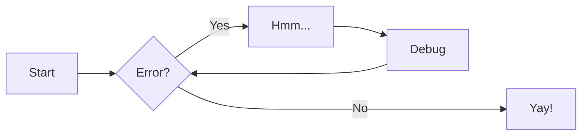
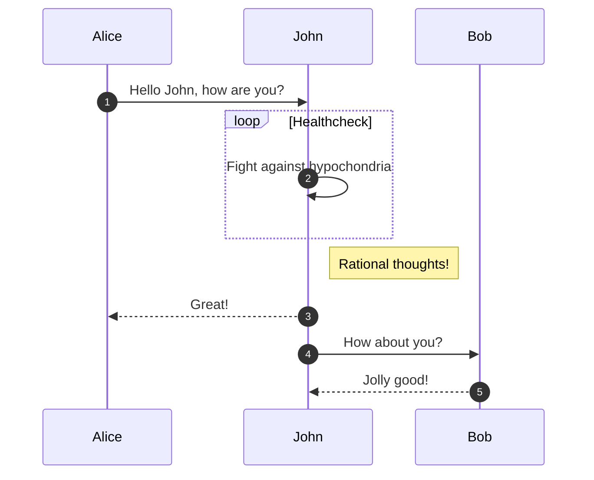
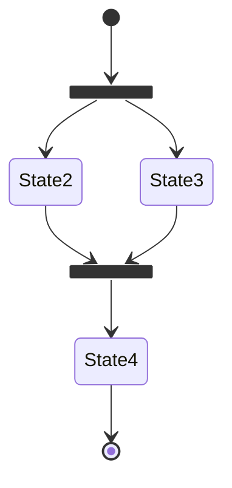
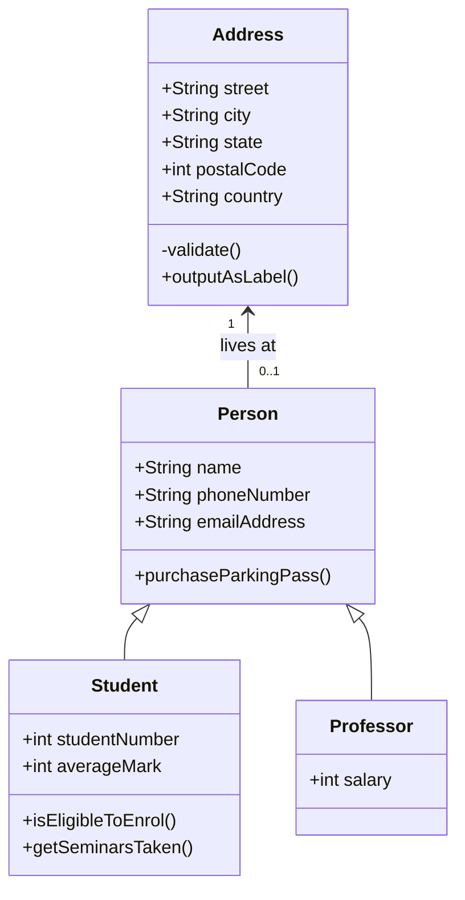
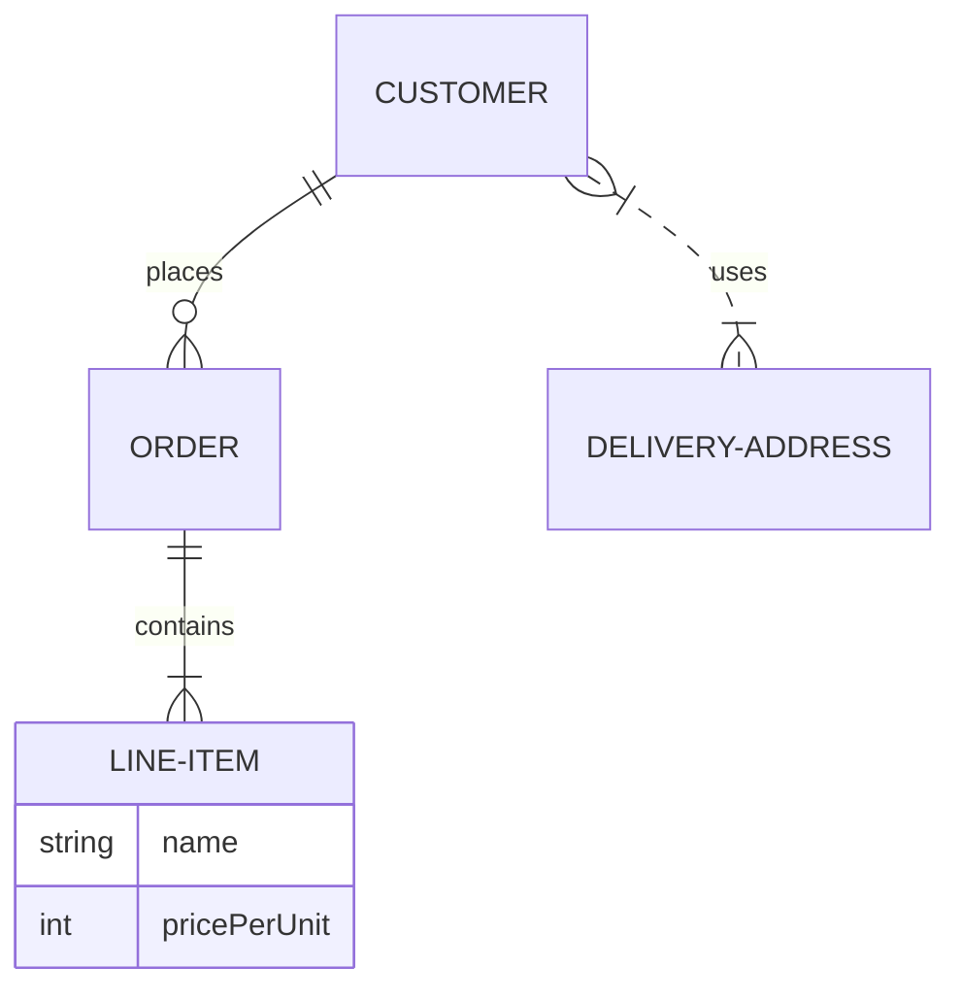

---
tags:
  - example tag #标签
comments: ture #开启评论区
search:
  #boost: 2 #站内搜索权值提升
  #boost: 0.5 #站内搜索权值下降
  exclude: true #搜索内容时不检索此页面
hide:
  - tags #隐藏标签
  - footer #隐藏“上一页”“下一页”
  - navigation #隐藏导航栏
  - toc #隐藏 toc
---


# Markdown 基本语法

本文依照Material for mkdocks的官方文档制作，目的是记录未来可能会用到的Markdown格式，本文中的许多Markdown格式均不具有普适性，仅可在pymdownx扩展支持下的Material for mkdocs中生效。

## Admonitions 警示块

### 使用方法

```Markdown
!!! note

    这是没有设置标题的 note 类型警示块
```

!!! note

    这是没有设置标题的 note 类型警示块

### 修改标题

```Markdown
!!! note "这里是[标题](#Admonitions-警示块)"

    这是设置了标题的 note 类型警示块，你可以在标题里任意发挥创意，例如加一个超链接，等等
```

!!! note "这里是[标题](#Admonitions-警示块)"

    这是设置了标题的 note 类型警示块，你可以在标题里任意发挥创意，例如加一个超链接，等等

### 删除标题

```Markdown
!!! note ""

    与修改标题类似，可以通过在类型限定符后添加空字符串完全省略图标和标题。但请注意，这在折叠块中无效
```

!!! note ""

    与修改标题类似，可以通过在类型限定符后添加空字符串完全省略图标和标题。但请注意，这在折叠块中是无效的

### 可折叠块

```Markdown
??? note

    启用 Details 扩展后，将警示块的起始标记从 !!! 更改为 ???，即可将其渲染为一个可折叠块，并在块的右侧显示一个小型折叠切换按钮
```

??? note

    启用 Details 扩展后，将警示块的起始标记从 !!! 更改为 ???，即可将其渲染为一个可折叠块，并在块的右侧显示一个小型折叠切换按钮

#### 自动展开

```Markdown
???+ note

    在 ??? 后面加一个 + 即可将折叠块默认设置为展开状态
```

???+ note

    在 ??? 后面加一个 + 即可将折叠块默认设置为展开状态

### 内联块

#### 右部内联块

!!! info inline end "右侧内联块"

    这是一个通过 inline end 修饰的内联块，因此该块会被渲染到文字右侧，这可以用于侧边栏显示信息

```Markdown
!!! info inline end "标题"

    这是一个通过 inline end 修饰的内联块，因此该块会被渲染到文字右侧，这可以用于侧边栏显示信息
```

#### 左部内联块

!!! info inline end "左侧内联块"

    这是一个只通过 inline 修饰的内联块，因此该块会被渲染到文字左侧，这同样可以用于侧边栏显示信息。另外，使用 inline 修饰符的警告框必须声明在你希望其旁边显示的内容块之前。如果没有足够的空间在目标内容块旁渲染警告框，例如在移动设备视口中，警告框将会自动扩展到视口的全宽度。

```Markdown
!!! info inline end "左侧内联块"

    这是一个只通过 inline 修饰的内联块，因此该块会被渲染到文字左侧，这同样可以用于侧边栏显示信息
```

### 支持类型

以下是 Material for MkDocs 支持的类型限定符，默认类型设置为 note:
`note`

!!! note

    这是一个 note 类型的警示块

`abstract`

!!! abstract

    这是一个 abstract 类型的警示块

`info`

!!! info

    这是一个 info 类型的警示块

`tip`

!!! tip

    这是一个 tip 类型的警示块

`success`

!!! success

    这是一个 success 类型的警示块

`question`

!!! question

    这是一个 question 类型的警示块

`warning`

!!! warning

    这是一个 warning 类型的警示块

`failure`

!!! failure

    这是一个 failure 类型的警示块

`danger`

!!! danger

    这是一个 danger 类型的警示块

`bug`

!!! bug

    这是一个 bug 类型的警示块

`example`

!!! example

    这是一个 example 类型的警示块

`quote`

!!! quote

    这是一个 quote 类型的警示块

### 自定义设置

#### 恢复到旧版本

在版本 8.5.6 之前，警示块的外观与现在的外观略有区别。具体对比可以看下图。
(TODO:塞一张对比图)
如果你想恢复到旧版的外观，可以将以下的 CSS 添加到一个额外的样式表中，并在 mkdocs.yml 中引用它即可。

=== "`docs/stylesheets/xxx.css`"

    ``` css
    .md-typeset .admonition,
    .md-typeset details {
      border-width: 0;
      border-left-width: 4px;
    }
    ```

=== "`mkdocs.yml`"

    ``` yaml
    extra_css:
      - stylesheets/extra.css
    ```

#### 自定义警示块

参见 [Custom admonitions](https://squidfunk.github.io/mkdocs-material/reference/admonitions/#custom-admonitions).

## Annotations 注解

注解(Annotations)是一项可以在文档中任何位置插入的一个小标记，点击后会展开一个工具提示、可以显示任意包含 Markdown 的内容。

### 使用方法

#### 添加注解

注解由两部分内容组成：

- 标记（Marker）: 放置在 .annotate 类块中，可以放在任何地方。
- 内容（Content）: 位于标记块下方的列表中。

```Markdown title="使用注解添加注释"
豫章(1)故郡，洪都新府。星分翼轸，地接衡庐。襟三江而带五湖，控蛮荆而引瓯越。物华天宝，龙光射牛斗之墟；人杰地灵，徐孺(2)下陈蕃之榻。雄州雾列，俊采星驰。(3)
{ .annotate }

1. 滕王阁在今江西省南昌市。南昌，为汉豫章郡治。唐代宗当政之后，为了避讳唐代宗的名（李豫），“豫章故郡”被替换为“南昌故郡”。所以现在滕王阁内的石碑以及苏轼的手书都作“南昌故郡”。
2. 徐孺子的省称。徐孺子名稚，东汉豫章南昌人，当时隐士。据《后汉书•徐稚传》，东汉名士陈蕃为豫章太守，不接宾客，惟徐稚来访时，才设一睡榻，徐稚去后又悬置起来。
3. 注解内容来自[百度汉语](https://hanyu.baidu.com/s?wd=%E6%BB%95%E7%8E%8B%E9%98%81%E5%BA%8F&from=poem)。
```

豫章(1)故郡，洪都新府。星分翼轸，地接衡庐。襟三江而带五湖，控蛮荆而引瓯越。物华天宝，龙光射牛斗之墟；人杰地灵，徐孺(2)下陈蕃之榻。雄州雾列，俊采星驰。(3)
{ .annotate }

1. 滕王阁在今江西省南昌市。南昌，为汉豫章郡治。唐代宗当政之后，为了避讳唐代宗的名（李豫），“豫章故郡”被替换为“南昌故郡”。所以现在滕王阁内的石碑以及苏轼的手书都作“南昌故郡”。
2. 徐孺子的省称。徐孺子名稚，东汉豫章南昌人，当时隐士。据《后汉书•徐稚传》，东汉名士陈蕃为豫章太守，不接宾客，惟徐稚来访时，才设一睡榻，徐稚去后又悬置起来。
3. 注解内容来自[百度汉语](https://hanyu.baidu.com/s?wd=%E6%BB%95%E7%8E%8B%E9%98%81%E5%BA%8F&from=poem)。

#### 嵌套注解

启用 `pymdownx.superfences` 后，可以通过将 `.annotate` 类添加到注解内容的列表项中来实现注解嵌套，并可以继续重复该过程。

```Markdown title="使用嵌套注解"
豫章(1)故郡，洪都新府。星分翼轸，地接衡庐。襟三江而带五湖，控蛮荆而引瓯越。物华天宝，龙光射牛斗之墟；人杰地灵，徐孺下陈蕃之榻。雄州雾列，俊采星驰。(2)
{ .annotate }

1. 滕王阁在今江西省南昌市。南昌，为汉豫章郡治。唐代宗当政之后，为了避讳唐代宗的名(1)，“豫章故郡”被替换为“南昌故郡”。所以现在滕王阁内的石碑以及苏轼的手书都作“南昌故郡”。
   { .annotate }

   1. 唐代宗李豫（726 年 11 月 11 日 － 779 年 6 月 10 日），初名李俶，陇西狄道（今甘肃省临洮县）人。唐朝第九位皇帝。

2. 注解内容来自[百度汉语](https://hanyu.baidu.com/s?wd=%E6%BB%95%E7%8E%8B%E9%98%81%E5%BA%8F&from=poem)。
```

豫章(1)故郡，洪都新府。星分翼轸，地接衡庐。襟三江而带五湖，控蛮荆而引瓯越。物华天宝，龙光射牛斗之墟；人杰地灵，徐孺下陈蕃之榻。雄州雾列，俊采星驰。(2)
{ .annotate }

1. 滕王阁在今江西省南昌市。南昌，为汉豫章郡治。唐代宗当政之后，为了避讳唐代宗的名(1)，“豫章故郡”被替换为“南昌故郡”。所以现在滕王阁内的石碑以及苏轼的手书都作“南昌故郡”。
   { .annotate }

   1. 唐代宗李豫（726 年 11 月 11 日 － 779 年 6 月 10 日），初名李俶，陇西狄道（今甘肃省临洮县）人。唐朝第九位皇帝。

2. 注解内容来自[百度汉语](https://hanyu.baidu.com/s?wd=%E6%BB%95%E7%8E%8B%E9%98%81%E5%BA%8F&from=poem)。

#### 与警示块结合

注解可以添加到提示块的标题和内容中，你只需要在提示块类型限定符后添加 annotate 修饰符即可实现，这与内联块的工作方式类似。

```Markdown
!!! note annotate "这是标题(1)"

    这是正文(2)，这是一段很水的正文。

1. 这是针对标题的注解
2. 这是针对正文的注解
```

!!! note annotate "这是标题(1)"

    这是正文(2)，这是一段很水的正文。

1. 这是针对标题的注解
2. 这是针对正文的注解

#### 与选项卡结合

内容选项卡支持注解，但 `.annotate` 类只能添加到单个内容选项卡块中，不能直接添加到整个选项卡容器上。

```Markdown title="带注解的选项卡"
=== "滕王阁序(节选)"

    时维九月，序属三秋。潦水尽而寒潭清，烟光凝而暮山紫。俨骖騑(1)于上路，访风景于崇阿；临帝子之长洲，得天人之旧馆。层峦耸翠，上出重霄；飞阁流丹，下临无地。鹤汀凫渚，穷岛屿之萦回；桂殿兰宫，即冈峦之体势。
    { .annotate }

    1. 驾车的马匹。

=== "梦游天姥吟留别"

    海客谈瀛洲(1)，烟涛微茫信难求，越人语天姥，云霞明灭或可睹。天姥连天向天横，势拔五岳掩赤城。天台四万八千丈，对此欲倒东南倾。我欲因之梦吴越，一夜飞度镜湖月。湖月照我影，送我至剡溪。谢公宿处今尚在，渌水荡漾清猿啼。脚著谢公屐，身登青云梯。半壁见海日，空中闻天鸡。千岩万转路不定，迷花倚石忽已暝。熊咆龙吟殷岩泉，栗深林兮惊层巅。云青青兮欲雨，水澹澹兮生烟。列缺霹雳，丘峦崩摧。洞天石扉，訇然中开。青冥浩荡不见底，日月照耀金银台。霓为衣兮风为马，云之君兮纷纷而来下。虎鼓瑟兮鸾回车，仙之人兮列如麻。忽魂悸以魄动，恍惊起而长嗟。惟觉时之枕席，失向来之烟霞。世间行乐亦如此，古来万事东流水。别君去兮何时还？且放白鹿青崖间。须行即骑访名山。安能摧眉折腰事权贵，使我不得开心颜！
    { .annotate }

    1. 古代传说中的东海三座仙山之一（另两座叫蓬莱和方丈）。
```

=== "滕王阁序(节选)"

    时维九月，序属三秋。潦水尽而寒潭清，烟光凝而暮山紫。俨骖騑(1)于上路，访风景于崇阿；临帝子之长洲，得天人之旧馆。层峦耸翠，上出重霄；飞阁流丹，下临无地。鹤汀凫渚，穷岛屿之萦回；桂殿兰宫，即冈峦之体势。
    { .annotate }

    1. 驾车的马匹。

=== "梦游天姥吟留别"

    海客谈瀛洲(1)，烟涛微茫信难求，越人语天姥，云霞明灭或可睹。天姥连天向天横，势拔五岳掩赤城。天台四万八千丈，对此欲倒东南倾。我欲因之梦吴越，一夜飞度镜湖月。湖月照我影，送我至剡溪。谢公宿处今尚在，渌水荡漾清猿啼。脚著谢公屐，身登青云梯。半壁见海日，空中闻天鸡。千岩万转路不定，迷花倚石忽已暝。熊咆龙吟殷岩泉，栗深林兮惊层巅。云青青兮欲雨，水澹澹兮生烟。列缺霹雳，丘峦崩摧。洞天石扉，訇然中开。青冥浩荡不见底，日月照耀金银台。霓为衣兮风为马，云之君兮纷纷而来下。虎鼓瑟兮鸾回车，仙之人兮列如麻。忽魂悸以魄动，恍惊起而长嗟。惟觉时之枕席，失向来之烟霞。世间行乐亦如此，古来万事东流水。别君去兮何时还？且放白鹿青崖间。须行即骑访名山。安能摧眉折腰事权贵，使我不得开心颜！
    { .annotate }

    1. 古代传说中的东海三座仙山之一（另两座叫蓬莱和方丈）。

#### 在其他元素中使用注解

通过 `Attribute Lists` 扩展，可以为大多数元素添加注解，但该扩展存在一些限制。例如，某些情况下需要结合 `Markdown in HTML` 扩展，使用带 .annotate 类的 `<div>` 包裹任意元素。使用这种方法，注解就可以被应用于块引用、列表等多种不被 Attribute Lists 支持的元素上了。但是，代码块的注解语法与此处的不同，这点我们后面会再次提及。
另外，数据表(data tables)不支持注解，这点可能会在官方的后续更新中解决。

```Markdown title="使用HTML来实现注解"
<div class="annotate" markdown>

> 壬戌之秋，七月既望(1)，苏子与客泛舟游于赤壁之下。清风徐来，水波不兴。举酒属客，诵明月之诗，歌窈窕之章。少焉，月出于东山之上，徘徊于斗牛之间。白露横江，水光接天。纵一苇之所如，凌万顷之茫然。浩浩乎如冯虚御风，而不知其所止；飘飘乎如遗世独立，羽化而登仙。

</div>

1.  农历每月十六。农历每月十五日为“望日”，十六日为“既望”。
```

<div class="annotate" markdown>

> 壬戌之秋，七月既望(1)，苏子与客泛舟游于赤壁之下。清风徐来，水波不兴。举酒属客，诵明月之诗，歌窈窕之章。少焉，月出于东山之上，徘徊于斗牛之间。白露横江，水光接天。纵一苇之所如，凌万顷之茫然。浩浩乎如冯虚御风，而不知其所止；飘飘乎如遗世独立，羽化而登仙。

</div>

1. 农历每月十六。农历每月十五日为“望日”，十六日为“既望”。

## Buttons 按钮

Material for MkDocs 为按钮(包含主要按钮和次要按钮)提供了专门的样式，这些样式可以应用于任意链接、标签(label)或按钮(button)元素。这对于包含的引导用户行动(Call-to-Action)的文档或是登录页等可能特别有用。

### 使用方法

#### 添加一个按钮

要将超链接渲染为按钮，只需在超链接后使用 `.md-button` 类选择器。如果特别设置了 primary color 和 accent color，按钮将自动应用选定的主题色。

```Markdown title="按钮示例"
[这是一个按钮](#Buttons-按钮-使用方法){ .md-button }
```

[这是一个按钮](#Buttons-按钮-使用方法){ .md-button }

#### 主要按钮(Primary Buttons)

如果你想用选定的 primary color 填充按钮，而非透明的底色填充，那么你就需要用到主要按钮。使用方法见下。

```Markdown title="主要按钮"
[这是一个主要按钮](#Buttons-按钮-使用方法){ .md-button .md-button--primary }
```

[这是一个主要按钮](#Buttons-按钮-使用方法){ .md-button .md-button--primary }

#### 带图标的按钮

```Markdown title="带图标的按钮"
[发送 :fontawesome-solid-paper-plane:](#Buttons-按钮-使用方法){ .md-button }
```

[发送 :fontawesome-solid-paper-plane:](#Buttons-按钮-使用方法){ .md-button }

## Code blocks 代码块

### 配置项

#### 复制按钮

如果你已经在`docs.yml`中配置好了`content.code.copy`，那么针对某一特定的代码块，你可以使用如下的格式关闭代码块复制按钮。

````text
``` { .cpp .no-copy}
// .cpp 应当为任何的特定的代码语言，不能是其他的文字
```
````

```{ .cpp .no-copy}
#include <iostream>
int main()
{
    std::cout<<"Hello world!";
    return 0;
}
```

如果不需要语法高亮，可以把特定的语言换成`.text`，这样代码块就不会产生文本高亮了。

#### 代码块内注解

与先前的注解方式略有不同，如果你想在一个代码块中显示注解，需要参考下面的格式。

````text
```cpp
#include <iostream>
int main()
{
    std::cout<<"Hello world!";
    return 0; // (1)!
}   // (2)
```

1. 注解必须放在注释语句内，而插入代码中的注解是 Insiders 特有的功能。
2. 如果你想显示这个注释符号(.cpp中是`//`)，那么删去序号后面的`!`即可。
````

```cpp
#include <iostream>
int main()
{
    std::cout<<"Hello world!";
    return 0; // (1)
}   // (2)!
```

1. 注解必须放在注释语句内，而插入代码中的注解是 Insiders 特有的功能。
2. 如果你不想显示这个注释符号(.cpp中是`//`)，那么在序号后面加一个`!`即可。但是需要注意，这种方式下每个注解只能渲染一个代码注释。如果需要添加多个代码注释，由于技术原因，注释字符无法被去除。

### 使用方法

#### 添加代码块

代码块必须用三个反引号包裹，并单独成行。在开头的反引号后添加语言或语言简写以启用语法高亮。

````Markdown title="添加代码块"
``` py
import tensorflow as tf
```
````

```py
import tensorflow as tf
```

#### 为代码块添加标题

可通过 `title="<标题>"` 为代码块添加自定义标题，提供额外的上下文信息。

````Markdown title="添加代码块标题"
``` py title="Hello world.py"
print('Hello world!')
```
````

``` py title="Hello world.py"
print('Hello world!')
```

#### 为代码块添加行号

你可以使用`linenums="<start>"`来为代码块添加行号，其中`<start>`可以被任意正整数(未验证)替换，不止局限于从1开始计数，这对于阅读从大型项目中剥离的代码非常有帮助。

````Markdown title="带行号的代码块"
``` py linenums="1"
def bubble_sort(items):
    for i in range(len(items)):
        for j in range(len(items) - 1 - i):
            if items[j] > items[j + 1]:
                items[j], items[j + 1] = items[j + 1], items[j]
```
````

``` py linenums="1"
def bubble_sort(items):
    for i in range(len(items)):
        for j in range(len(items) - 1 - i):
            if items[j] > items[j + 1]:
                items[j], items[j + 1] = items[j + 1], items[j]
```

#### 高亮选定行

通过 `hl_lines="<line1>..."` 参数高亮特定行，其中`<line1>`等即为要高亮的行数，中间以空格分隔或以连字符(`-`)连接。行号的计数与上一部分设置的起始行号`linenums`无关，而是从1开始计数。

=== "使用空格分隔的多行高亮"

    ```` markdown title="使用空格分隔的多行高亮"
    ``` py hl_lines="2 3"
    def bubble_sort(items):
        for i in range(len(items)):
            for j in range(len(items) - 1 - i):
                if items[j] > items[j + 1]:
                    items[j], items[j + 1] = items[j + 1], items[j]
    ```
    ````


    ``` py linenums="1" hl_lines="2 3"
    def bubble_sort(items):
        for i in range(len(items)):
            for j in range(len(items) - 1 - i):
                if items[j] > items[j + 1]:
                    items[j], items[j + 1] = items[j + 1], items[j]
    ```

=== "使用连字符表示的多行高亮"

    ```` markdown title="使用连字符表示的多行高亮"
    ``` py hl_lines="3-5"
    def bubble_sort(items):
        for i in range(len(items)):
            for j in range(len(items) - 1 - i):
                if items[j] > items[j + 1]:
                    items[j], items[j + 1] = items[j + 1], items[j]
    ```
    ````

    ``` py linenums="1" hl_lines="3-5"
    def bubble_sort(items):
        for i in range(len(items)):
            for j in range(len(items) - 1 - i):
                if items[j] > items[j + 1]:
                    items[j], items[j + 1] = items[j + 1], items[j]
    ```

#### 内联代码块语法高亮

启用`InLineHilite`后，使用下面的格式来应用内联代码块的语法高亮。

```Markdown title="内联代码块高亮"
我们使用`#!cpp int main()`函数来表明主函数。
```

我们使用`#!cpp int main()`函数来表明主函数。

#### 嵌入外部文件(?)

未做研究，详见[Embedding external files](https://squidfunk.github.io/mkdocs-material/reference/code-blocks/#embedding-external-files).

### 自定义样式

如果使用了 Pygments，那么Material for MkDocs 提供了颜色均衡的内置主题，可用于亮暗模式。相关内容详见[Customization](https://squidfunk.github.io/mkdocs-material/reference/code-blocks/#customization)，可用于自定义代码块某部分语法高亮时显示的颜色，还可以自定义注解部分显示的宽度。

## Content tabs 选项卡

有时，将不同的内容分组到不同的选项卡下是很有用的，例如描述如何在不同语言下编写功能相同的代码时。Material for MkDocs 提供了美观且实用的选项卡功能，可以将代码块和其他的内容分组显示。

### 配置项

#### 锚点链接

为了更方便地链接和共享内容选项卡，每个内容选项卡都会自动添加一个锚点链接。你可以复制选项卡的链接，并在同一页面或其他页面上创建链接。
TODO:测试一下，这部分还没尝试过

```markdown
=== "选项卡1"
    [选项卡2][tab2]
    [tab3]: #锚点链接--选项卡2

=== "选项卡2"
    [选项卡3][tab3]
    [tab3]: #锚点链接--选项卡3

=== "选项卡3"
    [锚点链接][tabAnchor]
    [tabAnchor]: #锚点链接
```

=== "选项卡1"
    [选项卡2][tab2]
    [tab3]: #锚点链接--选项卡2

=== "选项卡2"
    [选项卡3][tab3]
    [tab3]: #锚点链接--选项卡3

=== "选项卡3"
    [锚点链接][tabAnchor]
    [tabAnchor]: #锚点链接

#### 选项卡关联

启用下方的功能后，整个文档站点中的所有内容选项卡将根据标签相关联。当用户点击某个选项卡时，具有相同标签的选项卡将同步切换。
选项卡基于标签而非顺序关联，这意味着无论选项卡在容器中的顺序如何，标签相同的选项卡都会同时激活。此外，此功能与即时加载完全集成，并可在页面加载之间保持状态。

``` yaml title="mkdocs.yml"
theme:
  features:
    - content.tabs.link
```

### 使用方法

#### 分组代码块

代码块是内容选项卡的主要服务对象，可以视为内容选项卡的一种特殊情况。带有单个代码块的选项卡始终不会添加水平间距(?)。

```` text title="代码块分组"
=== "C"

    ``` c
    #include <stdio.h>

    int main() {
      printf("Hello world!\n");
      return 0;
    }
    ```

=== "C++"

    ``` cpp
    #include <iostream>

    int main() {
      std::cout << "Hello world!" << std::endl;
      return 0;
    }
    ```
````

=== "C"

    ``` c
    #include <stdio.h>

    int main() {
      printf("Hello world!\n");
      return 0;
    }
    ```

=== "C++"

    ``` cpp
    #include <iostream>

    int main() {
      std::cout << "Hello world!" << std::endl;
      return 0;
    }
    ```

#### 分组其他内容

当一个内容选项卡包含多个代码块时，它会显示出水平间距。垂直间距不会自动添加，但可以通过将选项卡嵌套在其他块中来实现(?)。

```text title="包含其他内容的选项卡"
=== "无序列表"

    * 白日依山尽
    * 黄河入海流

=== "有序列表"

    1. 欲穷千里目
    2. 更上一层楼
```

=== "无序列表"

    * 白日依山尽
    * 黄河入海流

=== "有序列表"

    1. 欲穷千里目
    2. 更上一层楼

#### 选项卡嵌套

启用 SuperFences 后，内容选项卡可以嵌套任意内容，包括进一步的内容选项卡，还可以嵌套在其他块（如提示块或引用块）中。例如：
TODO:未验证如何嵌套多层选项卡

````text title="套娃"
!!! example

    === "无序列表"

        ``` markdown
        * 白日依山尽
        * 黄河入海流
        ```

    === "有序列表"

        === "欲穷"
            千里目

        === "更上"
            一层楼
````

!!! example

    === "无序列表"

        ``` markdown
        * 白日依山尽
        * 黄河入海流
        ```

    === "有序列表"

        === "欲穷"
            千里目
            
        === "更上"
            一层楼

## Data tables 数据表

Material for MkDocs 为数据表格定义了默认样式，这是一种在项目文档中呈现表格数据的极佳方式。此外，通过引入第三方库和额外的 JavaScript，还可以实现可排序表格等自定义功能。

### 使用方法

数据表格可以在项目文档的任何位置使用，支持包含内联代码块、图标以及表情符号等任意的 Markdown 内容。

```Markdown title="数据表"
<!-- (1)! -->
| 作者 | 诗篇|
<!-- (2)! -->
| --- | --- |
| 李白 | 《将进酒》|
| 杜甫 | 《春望》  |
| 韩愈 | 《师说》  |
```

1. 这些`|`分隔符不对齐也是可以的
2. 这些`-`想写多少都可以，甚至只有一个也是可以的

| 作者 | 诗篇|
| --- | --- |
| 李白 | 《将进酒》|
| 杜甫 | 《春望》  |
| 韩愈 | 《师说》  |

#### 对齐方式

如果你需要将某一列的内容对齐到左侧、居中或右侧，可以在分隔符中使用 `:` 来实现。

=== "左侧对齐"

    ``` markdown hl_lines="2" title="左侧对齐的数据表"
    | 作者 | 诗篇|
    | :--- | :--- |
    | 李白 | 《将进酒》|
    | 杜甫 | 《春望》  |
    | 韩愈 | 《师说》  |
    ```

    | 作者 | 诗篇|
    | :--- | :--- |
    | 李白 | 《将进酒》|
    | 杜甫 | 《春望》  |
    | 韩愈 | 《师说》  |

=== "居中对齐"

    ``` markdown hl_lines="2" title="居中对齐的数据表"
    | 作者 | 诗篇|
    | :--: | :--: |
    | 李白 | 《将进酒》|
    | 杜甫 | 《春望》  |
    | 韩愈 | 《师说》  |
    ```

    | 作者 | 诗篇|
    | :--: | :--: |
    | 李白 | 《将进酒》|
    | 杜甫 | 《春望》  |
    | 韩愈 | 《师说》  |

=== "靠右对齐"

    ``` markdown hl_lines="2" title="靠右对齐的数据表"
    | 作者 | 诗篇|
    | ---: | ---: |
    | 李白 | 《将进酒》|
    | 杜甫 | 《春望》  |
    | 韩愈 | 《师说》  |
    ```

    | 作者 | 诗篇|
    | ---: | ---: |
    | 李白 | 《将进酒》|
    | 杜甫 | 《春望》  |
    | 韩愈 | 《师说》  |

### 自定义设置

#### 表格排序

如果需要让数据表格支持排序，可以引入 `tablesort`，该功能已与 Material for MkDocs 原生集成，并通过额外的 JavaScript 支持即时加载。详见[Sortable tables](https://squidfunk.github.io/mkdocs-material/reference/data-tables/#sortable-tables).
更多关于 `tablesort` 的内容详见[tablesort](https://tristen.ca/tablesort/demo/).

#### 从外部文件导入表格

使用插件[mkdocs-table-reader-plugin](https://timvink.github.io/mkdocs-table-reader-plugin/)，使得你能够从一个CSV或Excel文件中导入一个表格。

## Diagrams 图表

图表可以帮助传达不同技术组件之间复杂的关系和相互连接，是项目文档的极佳补充。Material for MkDocs 集成了 Mermaid.js，这是一个非常流行且灵活的绘图工具。下面的使用方法也都是基于 Mermaid 的语法进行的，Mermain的教程可以[在此处查看](https://mermaid.js.org/ecosystem/tutorials.html)。
TODO:学会怎么使用Mermaid画图

### 使用方法

#### 流程图(Flowcharts)

流程图用于表示工作流或过程。步骤会以各种节点形式呈现，并通过边连接，描述步骤的执行顺序。

```` markdown title="流程图"

````


#### 序列图(Sequence Diagrams)

序列图描述了多个对象或参与者之间的交互顺序，以及它们之间的信息交换。

```` markdown title="序列图"

````


#### 状态图(State Diagrams)

状态图用于描述系统的行为，将其分解为有限数量的状态及状态之间的转换。

```` markdown title="状态图"

````


#### 类图(Class Diagrams)

类图是面向对象编程的核心，用于通过建模类及它们之间的关系来描述系统结构。

```` markdown title="类图"

````


#### 实体关系图(E-R图, Entity-Relationship Diagrams)

实体关系图由实体类型组成，并描述实体之间的关系，常用于特定领域的知识建模。

```` markdown title="E-R图"

````


#### 其他类型的图表

除了上述类型，Mermaid.js 还支持饼图、甘特图、用户旅程、Git 图及需求图。然而，Material for MkDocs 对这些图表的支持有限，尤其是在移动端的表现不佳，因此不建议使用这些图表。
另外，虽然 Mermaid.js 的所有功能应开箱即用，但 Material for MkDocs 当前仅为流程图、序列图、类图、状态图和实体关系图调整了字体和颜色。

## Footnotes 脚注

### 使用方法

#### 添加脚注

脚注引用必须用方括号包裹，并以插入符号 `^` 开头，后接任意标识符，其语法类似于标准 Markdown 链接。

``` markdown title="脚注示例"
关关[^1]雎鸠[^2]，在河之洲。窈窕淑女，君子好逑。[^3]
```

关关[^1]雎鸠[^2]，在河之洲。窈窕淑女，君子好逑。[^3]

脚注内容必须使用与引用相同的标识符进行声明。它可以插入在文档中的任意位置，但最终总是会被渲染在页面的底部。此外，脚注内容会自动生成相对应的反向链接。

``` markdown title="单行脚注"
<!-- 单行注释 -->
[^1]: 关关：象声词，雌雄二鸟相互应和的叫声。
[^2]: 雎鸠：一种水鸟，一般认为就是鱼鹰，传说它们雌雄形影不离。
```

[:octicons-arrow-down-24: 跳转到脚注1](#fn:1)

[:octicons-arrow-down-24: 跳转到脚注2](#fn:2)

``` markdown title="多行脚注"
<!-- 多行注释，需要缩进 -->
[^3]:
    《周南·关雎》是中国古代第一部诗歌总集《诗经》中的第一首诗，通常认为这是描写男女恋爱的情歌。此诗首章以关雎鸟相向合鸣，相依相恋，兴起淑女配君子的联想；以下各章，又以采荇菜这一行为兴起主人公对女子疯狂的相思与追求。全诗情文并茂，在艺术上巧妙地采用了“兴”的表现手法，语言优美，善于运用双声叠韵和重章叠词，增强了诗歌的音韵美和写人状物、拟声传情的生动性。
```

[:octicons-arrow-down-24: 跳转到脚注3](#fn:3)

[^1]: 关关：象声词，雌雄二鸟相互应和的叫声。
[^2]: 雎鸠：一种水鸟，一般认为就是鱼鹰，传说它们雌雄形影不离。
[^3]:
    《周南·关雎》是中国古代第一部诗歌总集《诗经》中的第一首诗，通常认为这是描写男女恋爱的情歌。此诗首章以关雎鸟相向合鸣，相依相恋，兴起淑女配君子的联想；以下各章，又以采荇菜这一行为兴起主人公对女子疯狂的相思与追求。全诗情文并茂，在艺术上巧妙地采用了“兴”的表现手法，语言优美，善于运用双声叠韵和重章叠词，增强了诗歌的音韵美和写人状物、拟声传情的生动性。

#### 跳转到脚注

你可以使用超链接搭配脚注标识符 `fn` 来快捷跳转，你已经在上面见过效果了，其markdown实现如下：

``` markdown title="跳转到脚注"
[:octicons-arrow-down-24: Jump to footnote](#fn:1)
[:octicons-arrow-down-24: Jump to footnote](#fn:1)[:octicons-arrow-down-24: Jump to footnote](#fn:1)
```

## Formatting 设置格式

Material for MkDocs 支持多种 HTML 元素，可用于突出文档中的部分内容或应用特定的格式。此外，还支持 `Critic Markup`，可以显示文档的建议更改内容。
TODO:进一步了解，目前有些不理解

### 使用方法

#### 高亮更改内容

启用 Critic 后，可以使用 Critic Markup，从而突出显示建议的更改并在文档中添加内联评论。

``` text title="格式设置样例"
文本可以被{--删除--}，还可以被{++添加++}。这些格式特性还可以被{~~结合进~>结合在~~}一个单独的表达式中。你还可以利用此扩展{==高亮==}一些内容{>>而且你还可以在这里塞一些内联评论<<}。

{==

格式化也可以应用于块级内容：
将起始和结束标记放在单独的行上，并在标记与内容之间添加新行即可。

==}
```

上面的语法渲染结果如下：

文本可以被{--删除--}，还可以被{++添加++}。这些格式特性还可以被{~~结合进~>结合在~~}一个单独的表达式中。你还可以利用此扩展{==高亮==}一些内容{>>而且你还可以在这里塞一些内联评论<<}。

{==

格式设置也可以应用于块级内容。
将起始和结束标记放在单独的行上，并在标记与内容之间间隔一行即可。

==}

#### 高亮文本内容

启用 Caret、Mark 和 Tilde 后，可以通过简单的语法高亮文本，这种方法比直接使用 HTML 标签（如 `<mark>`、`<ins>`、`<del>`）要便捷些。

``` text title="格式设置样例"
- ==这部分等同于HTML的`<mark>`标签(高亮)==
- ^^这部分等同于HTML的`<ins>`标签(下划线)^^
- ~~这部分等同于HTML的`<del>`标签(删除线)~~
```

渲染结果如下：

- ==这部分等同于HTML的`<mark>`标签(高亮)==
- ^^这部分等同于HTML的`<ins>`标签(下划线)^^
- ~~这部分等同于HTML的`<del>`标签(删除线)~~

#### 上下标

启用 Caret 和 Tilde 后，可以通过简单的语法实现上下标。类似地，这比直接使用 HTML 标签（如 `<sub>`、`<sup>`）要更便捷些。

``` markdown title="格式设置样例"
<!-- 下标 -->
- H~2~O
<!-- 上标 -->
- A^T^A
```

渲染结果如下：

- H~2~O
- A^T^A

#### 添加键盘按键

未做研究，详见[Adding keyboard keys](https://squidfunk.github.io/mkdocs-material/reference/formatting/#adding-keyboard-keys).

## Grid 网格

Material for MkDocs 让您可以轻松将部分内容排布成网格，用于对表达相似意义或具有同等重要性的模块进行分组。网格布局非常适合构建索引页面，以简要概览文档的某一大部分内容。

### 使用方法

网格布局有两种类型：

1. 卡片网格(card grids)：将每个元素包装成悬停时会浮动的卡片。
2. 通用网格(generic grids)：可以将任意块元素排列成矩形形状。

#### 卡片网格

卡片网格可以为每个网格项提供悬停时的精美卡片。其语法有两种：列表(list)语法、块(block)语法，分别支持不同的使用场景。

##### 列表语法

列表语法是卡片网格的一种快捷语法，它由带有 `grid` 和 `cards` 类的 `<div>` 包裹的无序（或有序）列表组成。例如下面的示例。

``` markdown title="列表卡片示例"
<div class="grid cards" markdown>

- :fontawesome-brands-html5: __HTML__ 用于文章内容和结构的构建
- :fontawesome-brands-js: __JavaScript__ 用于实现网页交互
- :fontawesome-brands-css3: __CSS__ 可以避免文字溢出容器
- :fontawesome-brands-internet-explorer: __Internet Explorer__ ... 您哪位?

</div>
```

<div class="grid cards" markdown>

- :fontawesome-brands-html5: __HTML__ 用于文章内容和结构的构建
- :fontawesome-brands-js: __JavaScript__ 用于实现网页交互
- :fontawesome-brands-css3: __CSS__ 可以避免文字溢出容器
- :fontawesome-brands-internet-explorer: __Internet Explorer__ ... 您哪位?

</div>

列表语法支持任意种类的Markdown语法，只需确保外层 `<div>` 定义了 markdown 属性即可。以下是一个较为复杂的示例(来自官方文档)，包含了图标的设置和超链接等。

``` markdown title="更复杂的列表卡片示例"
- :material-clock-fast:{ .lg .middle } __光速安装！__

    ---

    通过 [`pip`](https://squidfunk.github.io/mkdocs-material/getting-started/#with-pip) 安装 [`mkdocs-material`](https://pypistats.org/packages/mkdocs-material)，一分钟都不需要！

    [:octicons-arrow-right-24: Getting started](https://squidfunk.github.io/mkdocs-material/getting-started/)

- :fontawesome-brands-markdown:{ .lg .middle } __区区 Markdown 而已__

    ---

    你只需要专注于内容，生成响应式、可搜索的静态网页就交给我们吧！

    [:octicons-arrow-right-24: Reference](https://squidfunk.github.io/mkdocs-material/reference/)

- :material-format-font:{ .lg .middle } __为你量身打造！__

    ---

    换颜色、换字体、换语言、换图标、换logo、诸如此类，仅需短短几行就能实现。

    [:octicons-arrow-right-24: Customization](https://squidfunk.github.io/mkdocs-material/customization/)

- :material-scale-balance:{ .lg .middle } __基于 MIT 协议开源__

    ---

    Material for MkDocs 基于 MIT 协议开源，你可以在 [GitHub](https://github.com/squidfunk/mkdocs-material) 上自由访问此项目。

    [:octicons-arrow-right-24: License](https://squidfunk.github.io/mkdocs-material/license/)

</div>
```

<div class="grid cards" markdown>

- :material-clock-fast:{ .lg .middle } __光速安装！__

    ---

    通过 [`pip`](https://squidfunk.github.io/mkdocs-material/getting-started/#with-pip) 安装 [`mkdocs-material`](https://pypistats.org/packages/mkdocs-material)，一分钟都不需要！

    [:octicons-arrow-right-24: Getting started](https://squidfunk.github.io/mkdocs-material/getting-started/)

- :fontawesome-brands-markdown:{ .lg .middle } __区区 Markdown 而已__

    ---

    你只需要专注于内容，生成响应式、可搜索的静态网页就交给我们吧！

    [:octicons-arrow-right-24: Reference](https://squidfunk.github.io/mkdocs-material/reference/)

- :material-format-font:{ .lg .middle } __为你量身打造！__

    ---

    换颜色、换字体、换语言、换图标、换logo、诸如此类，仅需短短几行就能实现。

    [:octicons-arrow-right-24: Customization](https://squidfunk.github.io/mkdocs-material/customization/)

- :material-scale-balance:{ .lg .middle } __基于 MIT 协议开源__

    ---

    Material for MkDocs 基于 MIT 协议开源，你可以在 [GitHub](https://github.com/squidfunk/mkdocs-material) 上自由访问此项目。

    [:octicons-arrow-right-24: License](https://squidfunk.github.io/mkdocs-material/license/)

</div>

当屏幕空间不足时（例如在移动设备上），网格项会拉伸到视口的全宽；在有相当足够的空间时，比例如当设置了隐藏两侧边栏时，网格则可以显示 3 项或更多内容。

##### 块语法

块语法允许卡片与其他任意元素结合排列。只需将 `card` 类添加到网格中的任意块元素上即可。

``` markdown title="块级卡片示例"
<div class="grid" markdown>

:fontawesome-brands-html5: __HTML__ 用于文章内容和结构的构建
{ .card }
:fontawesome-brands-js: __JavaScript__ 用于实现网页交互
{ .card }
:fontawesome-brands-css3: __CSS__ 可以避免文字溢出容器
{ .card }
> :fontawesome-brands-internet-explorer: __Internet Explorer__ ... 您哪位?

</div>
```

<div class="grid" markdown>

:fontawesome-brands-html5: __HTML__ 用于文章内容和结构的构建
{ .card }
:fontawesome-brands-js: __JavaScript__ 用于实现网页交互
{ .card }
:fontawesome-brands-css3: __CSS__ 可以避免文字溢出容器
{ .card }
> :fontawesome-brands-internet-explorer: __Internet Explorer__ ... 您哪位?

</div>

这种语法虽然初看略显繁琐，但可以自由混合卡片和其他元素，并且能自动适应网格布局。

#### 通用网格

通用网格允许将任意块元素，例如警示块(admonitions)、代码块(code blocks)、内容选项卡(content tabs)等排列成网格。只需用带有 `grid` 类的 `<div>` 标签包裹一组块元素即可。下面是一个简单的示例。

``` markdown title="通用网格示例"
<div class="grid" markdown>

=== "无序列表"

    * 长太息以掩涕兮，哀民生之多艰。
    * 余虽好修姱以鞿羁兮，謇朝谇而夕替。
    * 既替余以蕙纕兮，又申之以揽茝。

=== "有序列表"

    1. 既替余以蕙纕兮，又申之以揽茝。
    2. 亦余心之所善兮，虽九死其犹未悔。
    3. 怨灵修之浩荡兮，终不察夫民心。

``` title="选项卡代码块"
=== "无序列表"

    * 众女嫉余之蛾眉兮，谣诼谓余以善淫。
    * 固时俗之工巧兮，偭规矩而改错。
    * 背绳墨以追曲兮，竞周容以为度。

=== "有序列表"

    1. 忳郁邑余侘傺兮，吾独穷困乎此时也。
    2. 宁溘死以流亡兮，余不忍为此态也。
    3. 鸷鸟之不群兮，自前世而固然。
```

</div>
```
上面的内容会被渲染为如下样式。

<div class="grid" markdown>

=== "无序列表"

    * 长太息以掩涕兮，哀民生之多艰。
    * 余虽好修姱以鞿羁兮，謇朝谇而夕替。
    * 既替余以蕙纕兮，又申之以揽茝。

=== "有序列表"

    1. 既替余以蕙纕兮，又申之以揽茝。
    2. 亦余心之所善兮，虽九死其犹未悔。
    3. 怨灵修之浩荡兮，终不察夫民心。

``` title="选项卡代码块"
=== "无序列表"

    * 众女嫉余之蛾眉兮，谣诼谓余以善淫。
    * 固时俗之工巧兮，偭规矩而改错。
    * 背绳墨以追曲兮，竞周容以为度。

=== "有序列表"

    1. 忳郁邑余侘傺兮，吾独穷困乎此时也。
    2. 宁溘死以流亡兮，余不忍为此态也。
    3. 鸷鸟之不群兮，自前世而固然。
```

</div>

## Icons and Emojis 图标和表情

Material for MkDocs 的一大亮点是几乎无需额外的设置便可在项目文档中使用超过 10,000 个图标和数千种表情。此外，你还可以在 `mkdocs.yml`、自己的文档和模板中添加并使用自定义图标。

### 在库内搜索图标和表情

你可以使用 [material for mkdocs 的官方搜索功能](https://squidfunk.github.io/mkdocs-material/reference/icons-emojis/#search)来搜索并复制(相对路径)你想使用的表情或图标。仅支持英文搜索。
目前，Material for MkDocs 内置了以下四种图标集，上方的搜索功能也只能在这四个部分里寻找图标。

- :material-material-design: – [Material Design]
- :fontawesome-brands-font-awesome: – [FontAwesome]
- :octicons-mark-github-16: – [Octicons]
- :simple-simpleicons: – [Simple Icons]

### 使用方法

#### Emojis

在 Markdown 中使用 emoji 时，将表情符号的短代码放在两个冒号之间即可使用。如果使用(官方推荐)的 Twemoji 表情，则可以在 [Emojipedia](https://emojipedia.org/twitter/) 中查找短代码。

``` title="smile emoji"
:smile:
```

<!-- TODO:看看这个markdown有没有什么区别，如果有区别记得扩展到整个文档 -->

<div markdown>

:smile:

</div>

#### Icons

在`mkdocs.yml`中配置后，icons也可以像emoji一样使用，通过引用主题自带图标的有效相对路径(位于 `.icons` 目录下)，并将路径中的 `/` 替换为 `-`。

``` title="face laugh wink icon"
:fontawesome-regular-face-laugh-wink:
```

<div  markdown>

:fontawesome-regular-face-laugh-wink:

</div>

##### 添加颜色

启用 Attribute Lists 后，可以通过特殊语法为图标添加自定义 CSS 类。参考[with color](https://squidfunk.github.io/mkdocs-material/reference/icons-emojis/#with-colors).

##### 添加动效

与上一部分类似，你也可以通过自行定义 CSS 来实现图标的动效。参考[with animations](https://squidfunk.github.io/mkdocs-material/reference/icons-emojis/#with-animations).

#### 侧边栏的Emojis和Icons

借助内置的 typeset 插件，可以在标题中使用图标和表情符号，这些内容同样会在侧边栏中渲染，插件也会保留 Markdown 和 HTML 的格式。
然而这个插件仅限 Insiders 版本使用。

### 自定义样式

#### 在模板中使用图标

进行主题扩展、使用模板时才会用得上，详见[Using icons in templates](https://squidfunk.github.io/mkdocs-material/reference/icons-emojis/#using-icons-in-templates).

## Images 图片

虽然图片是 Markdown 的核心语法之一，但其在实际的使用中可能并不方便。Material for MkDocs 提供了更加舒适的图片处理体验，包括图片对齐样式和图片标题支持的功能。

### 配置项

#### 图片灯箱(?)

<!-- 本网站未配置 -->
如果您想为文档添加图片缩放功能，可以使用与 Material for MkDocs 完美集成的 `glightbox` 插件。通过 pip 安装：

``` bash
pip install mkdocs-glightbox
```

然后在 `mkdocs.yml` 中添加以下配置：

``` yaml
plugins:
  - glightbox
```

建议查看插件的[配置选项](https://github.com/blueswen/mkdocs-glightbox#usage)以获得最佳效果。

### 使用方法

#### 图片对齐

启用 Attribute Lists 后，可以通过添加 align 属性（如 align=left 或 align=right）来对齐图片。

<!-- 检查图片的相对路径如何设置 -->
=== "左对齐"

    ``` markdown title="图片左对齐"
    { align=left }
    ```

    <div markdown>

    { align=left width=300 }

    国破山河在，城春草木深。
    感时花溅泪，恨别鸟惊心。
    烽火连三月，家书抵万金。
    白头搔更短，浑欲不胜簪。

    </div>

=== "右对齐"

    ``` markdown title="图片右对齐"
    { align=right }
    ```

    <div markdown>

    { align=right width=300 }

    风急天高猿啸哀，渚清沙白鸟飞回。
    无边落木萧萧下，不尽长江滚滚来。
    万里悲秋常作客，百年多病独登台。
    艰难苦恨繁霜鬓，潦倒新停浊酒杯。

    </div>

=== "居中对齐?"

    为什么没有居中对齐？  
    `align` 属性不支持居中对齐，因此 Material for MkDocs 不支持此选项。你可以改用图片标题/说明语法，但加不加标题都是可以的。

如果屏幕宽度不足以在图片旁边显示文本（例如在移动设备上），图片会自动拉伸至视口的全宽。(?)

#### 图片标题/说明

Markdown 语法本身并不支持给图片添加标题，但我们可以借助 HTML 的 `<figure>` 和 `<figcaption>` 标签来实现标题功能。如下所示。

``` markdown title="带标题的图片"
<figure markdown="span">
  { width="300" }
  <figcaption>Image caption</figcaption>
</figure>
```

<figure markdown="span">
  { width="300" }
  <figcaption>Image caption</figcaption>
</figure>

##### 更简单的方式

使用 Caption 插件，你可以为任何 Markdown 块元素(包括图片)添加标题。

``` markdown title="带标题的图片"
{ width="300" }
/// caption
这里是标题喵喵喵
///
```

{ width="300" }
/// caption
这里是标题喵喵喵
///

#### 图片延时加载

现代浏览器支持通过 loading=lazy 指令对图片进行延迟加载。在不支持该功能的浏览器中，该功能则会自动降级为正常加载。(?)

``` markdown tite="手动设置图片延时加载"
{ loading=lazy }
```

{ loading=lazy }

#### 亮暗模式图片切换

如果您启用了颜色模式切换功能，那么就可以分别为亮色模式和暗色模式分别设置不同的图片，只需在图片的 URL 中添加 `#only-light` 或 `#only-dark` 的哈希标记即可。

``` markdown title="为亮暗模式分别使用不同的图片"


```


> 如果你自定义了颜色方案，请参看[Custom light scheme](https://squidfunk.github.io/mkdocs-material/reference/images/#light-and-dark-mode-custom-light-scheme)和[Custom dark scheme](https://squidfunk.github.io/mkdocs-material/reference/images/#light-and-dark-mode-custom-dark-scheme).

## Lists 列表

Material for MkDocs 支持多种列表格式，以满足不同的使用场景，包括通过标准 Markdown 支持的无序列表(unordered lists)和有序列表(ordered lists)，以及通过扩展支持的定义列表(definition lists)和任务列表(task lists)。

### 使用方法

#### 无序列表

无序列表可以通过在每行前加上 -、* 或 + 创建，这些符号用哪个都可以，你可以任意选择(当然，建议同级列表仅使用同种符号)。此外，各种类型的列表支持嵌套使用。

``` markdown title="无序列表"
- 《江城子》
    * 苏轼
        + 试问江南诸伴侣，谁似我，醉扬州。
* 《饮中八仙歌》
    - 杜甫
        * 李白斗酒诗百篇，长安市上酒家眠。
        * 天子呼来不上船，自称臣是酒中仙。
```

- 《江城子》
  - 苏轼
    - 试问江南诸伴侣，谁似我，醉扬州。
- 《饮中八仙歌》
  - 杜甫
    - 李白斗酒诗百篇，长安市上酒家眠。
    - 天子呼来不上船，自称臣是酒中仙。

#### 有序列表

有序列表必须以数字开头，并紧跟一个点号 `.`。数字无需主动设置序号，可以都设置为 `1.`，渲染时会自动编号。

``` markdown title="有序列表"
1. 唐朝

    1. 李商隐《锦瑟》

        1. 锦瑟无端五十弦，一弦一柱思华年。
        2. 庄生晓梦迷蝴蝶，望帝春心托杜鹃。
        3. 沧海月明珠有泪，蓝田日暖玉生烟。
        4. 此情可待成追忆，只是当时已惘然。


    2. 孟郊《登科后》

        1. 昔日龌龊不足夸，今朝放荡思无涯。

        2. 春风得意马蹄疾，一日看尽长安花。
```

1. 唐朝

    1. 李商隐《锦瑟》

        1. 锦瑟无端五十弦，一弦一柱思华年。
        2. 庄生晓梦迷蝴蝶，望帝春心托杜鹃。
        3. 沧海月明珠有泪，蓝田日暖玉生烟。
        4. 此情可待成追忆，只是当时已惘然。

    2. 孟郊《登科后》

        1. 昔日龌龊不足夸，今朝放荡思无涯。

        2. 春风得意马蹄疾，一日看尽长安花。

#### 定义列表

启用拓展后，可以使用简单的语法枚举任意键值对，例如函数或模块的参数等。

``` markdown title="定义列表"
`bool isEmpty(tree root)`

:   检测是否以root为根节点的树是否为空树

`int getIndex(int val)`
:   返回val在数组中的下标值，找不到则返回-1

```

`bool isEmpty(tree root)`

:   检测是否以root为根节点的树是否为空树

`int getIndex(int val)`
:   返回val在数组中的下标值，找不到则返回-1

#### 任务列表

启用拓展后，无序列表项前可加上 `[ ]` 表示未完成，或者 `[x]` 来表示已完成，以此来形成一份任务列表。

``` markdown title="任务列表"
* [x] 每天背单词
* [ ] 学会做荤菜
    * [x] 学会做鱼香肉丝
    * [x] 学会做宫保鸡丁
    * [ ] 学会做锅包肉
* [ ] 学会基本的 Markdown 语法
```

<!-- 忽略 TODO Tree 带来的高亮，目前还没看怎么才能忽略掉 -->
- [x] 每天背单词
- [ ] 学会做荤菜
  - [x] 学会做鱼香肉丝
  - [x] 学会做宫保鸡丁
  - [ ] 学会做锅包肉
- [ ] 学会基本的 Markdown 语法

## Math 数学功能

### 配置项

#### 可选的库

`MathJax` 和 `KaTeX` 是两个流行的数学公式渲染库，用于在浏览器中显示数学内容。虽然两者提供类似的功能，但它们使用不同的语法并具有不同的配置选项。本章提供了如何将它们与 Material for MkDocs 集成的有关信息。

- MathJax 是一个功能强大且灵活的库，支持多种输入格式（如 LaTeX、MathML、AsciiMath）和输出格式（如 HTML、SVG、MathML）。

- KaTeX 是一个轻量级的库，专注于速度和简单性。它支持 LaTeX 语法的子集，并能够将数学公式渲染为 HTML 或 SVG。

本网页使用 `MathJax` 进行数学公式的渲染。

#### 二者对比

在决定使用 MathJax 还是 KaTeX 时，有几个关键的因素需要考虑：

- __速度__：KaTeX 通常比 MathJax 更快。如果您的网站需要快速渲染大量复杂公式，KaTeX 可能是更好的选择。

- __语法支持__：MathJax 支持更广泛的 LaTeX 命令，并且可以处理多种数学标记语言（如 AsciiMath 和 MathML）。如果您需要高级的 LaTeX 功能，MathJax 或许更合适。

- __输出格式__：两者都支持 HTML 和 SVG 输出。然而，MathJax 还提供 MathML 输出，这对于可访问性很重要，因为屏幕阅读器可以读取 MathML。

- __可配置性__：MathJax 提供更多的配置选项，使用户能够更精确地控制其行为。如果您有特定的渲染需求，MathJax 可能是更灵活的选择。

- __浏览器支持__：虽然两个库在现代浏览器中都表现良好，MathJax 对旧版浏览器的兼容性更好。如果您的受众使用各种浏览器（包括旧版），MathJax 可能更安全。

总结：KaTeX 以速度和简洁著称，而 MathJax 提供更多功能和更好的兼容性，但速度较慢。选择使用哪一个主要取决于您的具体需求和限制。

### 使用方法

#### 块级元素

块级数学公式必须用 `#!latex $$...$$` 或 `#!latex \[\]` 包裹，并占用单独的行。

``` latex title="块级数学公式"
$$
\cos x=\sum_{k=0}^{\infty}\frac{(-1)^k}{(2k)!}x^{2k}
$$
```

$$
\cos x=\sum_{k=0}^{\infty}\frac{(-1)^k}{(2k)!}x^{2k}
$$

#### 内联行内元素

行内数学公式必须用 `#!latex $...$` 或 `#!latex \(...\)` 包裹。

``` latex title="行内数学公式"
设 $n$ 是偶数, 则 $\exists \in \mathbb{Z}$, 使得 $n = 2k$. 反之, 若 $\exists k \in \mathbb{Z}$, 使得 $n = 2k$, 则 $n$ 为偶数.
```

设 $n$ 是偶数, 则 $\exists k \in \mathbb{Z}$, 使得 $n = 2k$. 反之, 若 $\exists k \in \mathbb{Z}$, 使得 $n = 2k$, 则 $n$ 为偶数.

## Tooltips 提示信息

技术文档中人们通常会使用许多缩写，而对于一些项目的新用户来说，这些缩写可能需要额外的解释。为了解决这个问题，Material for MkDocs 使用了一系列 Markdown 扩展来实现全站范围的术语表功能。

### 配置项

#### 改进的提示信息

在启用该项功能后，Material for MkDocs 会用更美观的小型工具提示替代浏览器对 title 属性的渲染逻辑。(?)

启用后，工具提示将应用于以下元素：

- __内容部分__：带有 `title` 属性的元素、永久链接和代码复制按钮。

- __页眉部分__：主页按钮、标题、配色方案切换器和代码库链接。

- __导航部分__：被省略号缩短的链接（如 `...`）。

### 使用方法

#### 添加提示信息

##### 超链接

Markdown 语法允许为每个链接指定 title 属性，当启用了改进的信息提示后，这些 title 属性将显示为精美的工具提示。

``` markdown title="行内语法的具有提示信息的超链接"
[把鼠标悬停在超链接上面](#添加提示信息 "这里是提示信息")
```

[把鼠标悬停在超链接上面](#添加提示信息 "这里是提示信息")

你还可以使用引用超链接，示例如下。

``` markdown title="使用引用超链接的具有提示信息的超链接"
[把鼠标悬停在超链接上面][hoveringInfo]

    [hoveringInfo]: #添加提示信息 "这里是提示信息"
```

[把鼠标悬停在超链接上面][hoveringInfo]

    [hoveringInfo]: #添加提示信息 "这里是提示信息"

##### 其他元素

对于其他元素，可以通过启用 `Attribute Lists` 扩展来为元素添加提示信息。

``` markdown title="带提示信息的图标"
:material-information-outline:{ title="Important information" }
```

:material-information-outline:{ title="Important information" }

#### 添加缩写提示

缩写提示是一种类似于 URL 和脚注的特殊语法，可以为文本中的术语或缩写定义工具提示。其语法类似如下示例。

``` markdown title="缩写示例"
HTML 规范目前正在由 W3C 维护.

<!-- 方括号内的是想要说明的缩写，冒号后面跟着的即为缩写的全称解释 -->
*[HTML]: Hyper Text Markup Language, 超文本标记语言
*[W3C]: World Wide Web Consortium, 万维网联盟
```

HTML 规范目前正在由 W3C 维护.

*[HTML]: Hyper Text Markup Language, 超文本标记语言
*[W3C]: World Wide Web Consortium, 万维网联盟

#### 添加术语表

如果你有为所有网页的同一术语都添加提示信息，那么你可能需要新建一个术语表。详情可见[Adding a glossary](https://squidfunk.github.io/mkdocs-material/reference/tooltips/#adding-a-glossary).
